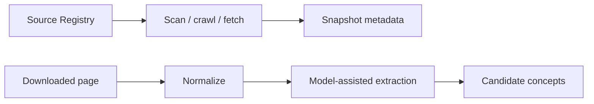

# SwissTIP knowledge-builder demos

These CLIs are small proofs of the acquisition and concept proposal stages
described in the product and technical specifications:



They run only as operator-triggered knowledge-builder commands. They are not
imported by, or suitable for, request-time MCP handling.

Candidate concepts and their generated questions are authoring and evaluation
aids. The calling LLM will interpret user questions and select published catalog
identifiers. Reviewed promotion into stable concept identifiers, catalog
operations and context schemas, and immutable Knowledge Release publication
are not yet implemented; see the [implementation plan](../../TODO.md).

For hackathons and testing, the [experimental short path](../../docs/experiments/2026-09-06-experimental-knowledge.md)
turns saved extractor output into a usable local bundle without human review.
It includes Python and CLI catalog/search/concept/evidence access and preserves
unreviewed status, claims, citations and model provenance.

## Install

Python 3.11 or newer is required. From the repository root:

```shell
python -m venv .venv
./.venv/Scripts/python.exe -m pip install -e packages/core -e packages/ingestion -e apps/knowledge-builder
```

On macOS or Linux, use `.venv/bin/python` instead. The examples below use the
Windows executable path; activation is not required.

## Propose concepts from downloaded pages

To repeat a saved GUI extraction from the command line with fresh model calls,
use the [saved extraction script](../../scripts/admin/README.md). It preserves
the original job and records a new report, progress log and draft-status summary.

Hugging Face profiles default to `response_mode = "json_schema"`. The explicit
`prompt_only` option instead supplies the schema in the system prompt and omits
the API's `response_format` constraint. `apertus_70b_prompt_only` is an experimental
profile for investigating PublicAI's observed whitespace loop on the nested v4
schema. It is not selected automatically. Both modes retain model identity and
completion checks; extraction still requires local schema, evidence and logic
validation followed by semantic review. The response mode is recorded in the
effective profile and separates model checkpoints. A complete JSON response alone
does not establish valid claims or sufficient coverage.

The repository defaults to `concept_extraction_v4` with DeepSeek V4 Pro through
the direct DeepSeek API, using `DEEPSEEK_API_KEY` from the environment. V4 adds
logical source blocks, structured claims, separate semantic assessments, source
coverage auditing and one bounded repair. Use `--dry-run` to inspect the complete
source inventory without a model call. `--structured` explicitly selects v4 when
using another configuration. The [v4 workflow](../../docs/experiments/2026-09-06-structured-extraction.md)
includes offline review export/import commands and validation limits. Select
`concept_extraction_v3` in a separate configuration for comparisons with the
frozen POC-01 evidence.

V4's `swisstip.structured-review/v2` response contract requires a separate
`condition_logic` assessment and six `scope_fields` assessments on every claim.
A negative detail check prevents retention even when a broad summary approves
the concept. The validator also rejects a review that calls a source rule
conditional while approving empty conditions. It permits empty conditions for
unconditional assertions, including obligations. These checks enforce complete,
internally consistent model assessments; they do not independently prove source
entailment or detect every mistaken approval. Reports preserve the review version
and original assessments. Old reports remain readable, while changed prompt/schema
bytes prevent their review checkpoints from satisfying the new request contract.

After JSON shape validation, v4 collects independent reference, condition-tree
and clause errors together in each rejection's `errors` array. Entries identify
the affected field path and reason; the existing `reason` remains the first-error
summary. A bad root no longer hides an altered quotation or errors in later claims.
When a repair and its follow-up audit fit the remaining budget, invalid proposals
are sent for repair before semantic review. The repair payload contains each
proposal once and all its collected diagnostics, subject to the existing input
size limit. If every proposal is still invalid, review is skipped and the source
stays unresolved. With no repair left, valid proposals in a mixed result can still
be reviewed. A genuinely empty extraction still receives a coverage audit.
Schema-valid extraction checkpoints remain available for replay and revalidation;
changing repair feedback changes the repair checkpoint key. The planned call
ceiling and one-repair limit remain enforced, including odd page request limits.

V4 review input has its own `[extraction].max_review_input_characters` limit,
defaulting to 64000 when omitted from an older configuration. It counts the full
serialized user payload: source evidence, proposals, rendered descriptions and
review-validation feedback. It excludes the separately supplied system prompt
and response schema. Oversized review input is rejected with actual/configured
character counts before a model call; nothing is shortened to fit. This limit
is independent of `chunk_content_characters`, which still controls source packing
and the existing four-times-source extraction/repair input allowance.
If extraction or repair input exceeds that allowance, the pipeline tries compact
JSON separators, preserving every source and feedback value. It logs the size
reduction when this fits; input still over the limit is rejected before a call.
Normal-sized requests retain their existing bytes and checkpoint keys. This
formatting fallback adds no request, retry or allowance and changes no verdict.

Logical normalization version `swisstip.logical-blocks/v3` classifies explicitly
marked Zurich related-content navigation as excluded inventory. Source text,
block IDs and ownership remain intact. Contacts, download references and
substantive condition lists remain available for review; link density alone
does not determine exclusion. The changed version separates new source hashes
and checkpoint identities from old normalization results.

`swisstip-concepts` accepts one or more local file paths, directory paths, or
wildcard patterns. Eligible files have an `.html`, `.htm`, `.txt`, `.md`, or
`.markdown` extension. Directory scanning recursively includes supported files
in nested subfolders. It does not descend into symlinked or junction child
directories encountered beneath the supplied root. A link in the explicitly
supplied root path is treated as deliberate. The command does not download
URLs. From the repository root, run:

```powershell
.venv\Scripts\swisstip-concepts.exe downloaded\permit-page.html `
  downloaded\arrival-checklist.md `
  --config config\semantic-models.toml
```

Pass a directory to process supported files throughout its directory tree:

```powershell
.venv\Scripts\swisstip-concepts.exe downloaded `
  --config config\semantic-models.toml
```

Wildcard patterns are expanded by the CLI. Quote them so the shell passes the
pattern unchanged, particularly when using a shell that expands wildcards
itself:

```powershell
.venv\Scripts\swisstip-concepts.exe "downloaded\permit-*.html" `
  --config config\semantic-models.toml
```

Recursive `**` patterns are also supported. Keep the pattern quoted:

```powershell
.venv\Scripts\swisstip-concepts.exe "downloaded/**/*.html" `
  --config config\semantic-models.toml
```

Wildcard syntax takes precedence even when a literal path containing `*`, `?`,
or `[` exists. Escape a literal opening bracket with a bracket expression; for
example, use `page[[]1].html` to select the literal file `page[1].html`.

Resolved files are ordered deterministically. If multiple inputs resolve to the
same canonical path, it is processed only once. A wildcard that matches no
eligible files, or a directory tree with no supported files, is reported as an
input error rather than producing an empty result. Files discovered through a
directory or wildcard cannot be symlinks; an explicit file symlink remains an
intentional input. Recursive wildcard matching skips hidden path components
unless the pattern names them explicitly.

Input discovery is capped at 100,000 filesystem entries by default, including
directories and unsupported files. Use `--max-discovery-entries` to choose a
different positive ceiling. The configured `max_pages_per_run` limit is applied
to the de-duplicated eligible files before they are read or sent to a model.

The command emits one JSON wrapper to stdout, with a separate proposal report
for every input file. Use `--compact` for unindented JSON or redirect stdout to
a file when a stored proposal is useful:

```powershell
.venv\Scripts\swisstip-concepts.exe downloaded\permit-page.html `
  --config config\semantic-models.toml `
  --compact > concept-proposals.json
```

The output is a proposal report, not a published taxonomy. Every extracted item
remains a candidate concept and includes exact page evidence. The report also
records the selected profile, provider and model identity, input and output
hashes, semantic operation, prompt profile, request identifiers when available,
token usage when available, and validation warnings. A candidate with
unsupported or non-exact evidence is rejected instead of being silently
accepted; other valid candidates in the same response remain available.
The ordered `model_identities` entries retain the configured `model`, exact
wire `requested_model`, raw response `observed_model`, provider and request ID
for each generation or review completion. Missing observations remain unknown.

The historical `concept_extraction_v3` prompt selects numbered source spans and
Python attaches the original quotations. Paragraphs, lists and table rows are
preserved; generic contact, navigation, feedback and embedded news sections are
filtered before chunking. Proposals must cite their primary section. A separate
call to the selected model reviews claim support, applicability, questions,
language and type. Unsupported or uncertain proposals are excluded and recorded
with reasons. Both generation and review count toward request and usage limits.
Reports include these assessments, quality counts, the effective configuration,
conservative consolidation and possible duplicate pairs. Model review is not
authoritative verification; the output still requires human review. For repeat runs,
saved logs, review worksheets and 8B/70B comparison instructions, see the
[zh.ch quality experiment](../../scripts/test/zhch/README.md).
The [2026-09-05 experiment report](../../docs/experiments/2026-09-05-zhch-concept-extraction.md)
records the completed 8B/70B comparison, failure history and remaining quality issues.

### Find and customize extraction prompts

The system prompts live in
[`packages/ingestion/src/swisstip/ingestion/prompts`](../../packages/ingestion/src/swisstip/ingestion/prompts/README.md)
as bundled Markdown resources. That directory's README maps every profile to
its extraction and review files. The v3 extraction prompt combines the v2 base
and a v3 extension; v4 combines its instructions and a synthetic worked example.
The v1 and v2 extraction profiles each use a single file.

To customize prompts without editing application code, add either or both
optional fields to the existing `[extraction]` table in your model config:

```toml
[extraction]
prompt_profile = "concept_extraction_v4"
extraction_prompt_file = "prompts/my-extraction.md"
review_prompt_file = "prompts/my-review.md"
# Keep the existing extraction limits here as well.
```

Paths resolve relative to the TOML file, independently of the working directory.
Absolute paths also work. Each file replaces the complete system prompt for its
role. Omitted fields retain the bundled defaults. Files must contain non-empty
UTF-8 text; a UTF-8 BOM is accepted and line endings are normalized to LF.
Missing, unreadable, empty or invalid UTF-8 files stop the run before provider
creation. Review overrides require v3 or v4. Overrides also apply when
`--structured` selects v4, so keep profile-specific customizations in separate
configuration files.

Inspect the complete effective prompts locally before running inference:

```sh
swisstip-concepts downloaded-page.html --config config/semantic-models.toml \
  --dry-run > extraction-plan.json
```

The dry-run plan and each page report include `effective_prompts`, with the exact
system text, SHA-256 hash of its UTF-8 encoding, and source files for extraction
and review. Copy the desired `text` value into your override file as a starting
point. Files are loaded once per CLI run; later edits take effect on the next run.
Checkpoint keys already include the actual system prompt, user payload and
response schema, so changed prompt text cannot reuse the old request's response.

Prompts can change extraction priorities and model review behavior. Output
schemas, evidence validation, request budgets and human-review requirements
remain implemented in Python. Preserve the defaults' evidence and scope
instructions when editing: schema-valid output alone does not establish factual
support. This provides file-based customization; there is no app prompt editor yet.

### Select a model profile

Model identities and connections are in the shared
[`config/model-profiles.toml`](../../config/model-profiles.toml) catalog. Extraction
settings and profile selection remain in
[`config/semantic-models.toml`](../../config/semantic-models.toml). Change only
this value to select a preconfigured profile:

```toml
[semantic_model]
active_profile = "deepseek_v4_pro"
```

The available values are:

| Profile | Runtime | Configured model | Intended use |
| --- | --- | --- | --- |
| `ollama_local` | Local Ollama API | `MichelRosselli/apertus:8b-instruct-2509-q4_k_m` | Offline/local testing with an unofficial community package |
| `apertus_8b` | Hugging Face router | `swiss-ai/Apertus-8B-Instruct-2509` | Free-account testing |
| `apertus_70b` | Hugging Face router | `swiss-ai/Apertus-70B-Instruct-2509` | Optional hosted Apertus extraction/review |
| `deepseek_v4_pro` | Direct DeepSeek API | `deepseek-v4-pro` | Repository default; JSON-object extraction/review; requires `DEEPSEEK_API_KEY` |
| `deepseek_v4_1_flash` | Direct DeepSeek API | `deepseek-flash` | Optional Flash extraction/review; requires `DEEPSEEK_API_KEY`; see [version mapping](../../config/README.md#deepseek-v41-flash) |
| `groq_gpt_oss_120b` | Groq API | `openai/gpt-oss-120b` | Optional strict-schema extraction/review; requires `GROQ_API_KEY` |

For example, switching to local 8B requires only:

```toml
[semantic_model]
active_profile = "ollama_local"
```

Each extraction profile refers to a catalog entry using `model_profile` and keeps
its timeout, response mode and any Ollama context/keep-alive settings. The catalog
owns adapter, URL, model, provider and optional billing configuration. Generation
and extraction limits apply across extraction profiles. To add another model using
Ollama, Hugging Face, Groq or DeepSeek, define it once in the catalog and add a referring extraction
profile; future switches change only `active_profile`. A new provider API requires
a corresponding adapter implementation. See the [configuration examples and
standalone-config compatibility](../../config/README.md).

DeepSeek V4 Pro uses `response_mode = "json_object"` with the trusted schema in
the system prompt and thinking explicitly disabled. Extraction/review still
validate schema, evidence and coverage locally. Select `deepseek_v4_pro` in the GUI
or this file and set `DEEPSEEK_API_KEY` before starting the process. See the
[DeepSeek setup and validation limits](../../config/README.md#deepseek-v4-pro).

GPT-OSS 120B uses Groq strict JSON schema output and low reasoning effort. Select
`groq_gpt_oss_120b` and set `GROQ_API_KEY` before launching. The
[three-model comparison runner](../../scripts/test/model_comparison/README.md)
exercises this same extraction/review pipeline with frozen source/configuration,
redacted API diagnostics and separate measurements of API time and quota pacing.

Selection is explicit and fail-closed. The command does not fall back to another
profile or model after an authentication, quota, availability, transport, or
response-validation failure.

PublicAI requests also disable the provider's own model fallback and completion
cache using `disable_fallbacks=true` and `cache={"no-cache":true,"no-store":true}`.
This prevents an unavailable Apertus request from silently becoming a cached Qwen
completion. The configured Hugging Face endpoint and strict response-identity
checks remain in use; local checkpoints can still be reused when requested.
Known upstream HTTP 429 codes `maximum_token_reached` and `rate_limit_exceeded`
appear in progress/errors without echoing provider response bodies. These identify
an upstream limit, not necessarily the caller's Hugging Face balance. See the
[Apertus fallback investigation and verification](../../docs/experiments/2026-09-09-apertus-publicai-fallback.md).

Hugging Face response identity must equal the configured model or that model
with its selected `:provider` suffix. The explicit compatibility alias list in
[`huggingface_provider.py`](src/swisstip/builder/huggingface_provider.py) also
accepts the existing `swiss-ai/apertus-8b-instruct` response fixture only for
PublicAI requests to `swiss-ai/Apertus-8B-Instruct-2509`. This is a deliberate
alias policy, not a general case-folding or revision-stripping rule. Other
aliases need an explicit reviewed mapping; unexplained mismatches fail without
retry or checkpointing. Both requested and observed names remain visible.

The extraction section also places hard limits on pages, normalized input
characters, requests per page, and requests per run. Every page is chunked and
the complete batch is checked before the first model call. An over-budget batch
fails instead of partially running or incurring unbounded paid requests.

Optional `--checkpoint-dir /tmp/swisstip-checkpoints` persists successful model
responses, including generation and review separately. Matching input, model,
prompt, schema and output-affecting settings reuse previous responses. The zh.ch
wrapper supplies a shared checkpoint directory automatically. Use
`--fresh-inference` (PowerShell wrapper: `-FreshInference`) for independent tests;
omit it to resume. Existing logs without checkpoints cannot reconstruct results.
Checkpoint v2 retains requested and observed model identities and revalidates
them against the selected profile and current alias policy on every cache hit.
The older v1 cache namespace is not reused because its observed HF identity
cannot be established. Old files and historical experiment artifacts remain
unchanged; the first new run makes fresh calls within the configured budgets.

The optional `[recovery]` table controls `max_retries`, `backoff_seconds`,
`max_backoff_seconds` and `max_retry_after_seconds`. Ordinary backoff is capped
at 30 seconds, while provider-requested waits are allowed up to 300 seconds by
default, with the exact header logged and progress every 15 seconds. The
repository configuration allows two additional
attempts for transient HF, Groq or DeepSeek failures. All attempts count toward existing page/run
limits, and no authentication or validation failure is retried. Result
`execution` metrics distinguish new attempts and tokens from cached responses;
report token totals include historical usage from those reused responses.
Truncated HF responses expose finish reason, reported token usage and response
sizes in failure diagnostics, without exposing or accepting partial content.
For truncated reviews only, `recovery.review_fallback_batch_size` (default 2)
enables smaller batches, shrinking to single proposals if necessary. Each
successful batch is checkpointed; split markers allow interrupted work to
resume without repeating its parent. All calls share the existing attempt
budgets. `execution.review_fallbacks` records this work separately from logical
review counts; invalid verdicts and single-proposal truncation still fail.
Each fallback event retains `child_model_identities`. A combined review with
different approved observed names has `observed_model: null`; the child records
preserve each exact name, including through nested splits.
V3 skips structurally identified generic link-only HTML chunks before inference,
records them in `skipped_chunks`, and preserves unaffected checkpoint keys.
See the [recovery and comparison details](../../scripts/test/zhch/README.md).

### Run with local Ollama

Install and start Ollama, then make sure the model named by `ollama_local` is
available locally:

```powershell
ollama pull MichelRosselli/apertus:8b-instruct-2509-q4_k_m
```

Set `active_profile = "ollama_local"`. This profile calls
`http://127.0.0.1:11434` and does not require a token. The configured quantized
8B model is the practical local option; actual GPU residency and speed depend on
available VRAM, context size, and Ollama's CPU offloading.

The configured Ollama artifact is an unofficial community packaging of the
official Apertus weights. Use the Hugging Face profiles when the canonical model
deployment and chat template are required.

### Run with Hugging Face

Both Hugging Face profiles call the configured Inference Providers router. The
only secret read from the environment is `HF_TOKEN`; tokens in the TOML file are
rejected. Create a fine-grained token with permission to make calls to Inference
Providers. In the same PowerShell session that runs the command:

```powershell
$env:HF_TOKEN = "hf_your_token_here"
.venv\Scripts\swisstip-concepts.exe downloaded\permit-page.html `
  --config config\semantic-models.toml
```

Set `active_profile` to `apertus_8b` for the configured 8B testing model or
`apertus_70b` for the configured 70B demo model. The Python command and token
mechanism are identical; only the profile selector and the Hugging Face account
behind the token differ. Account quota and provider/model availability still
apply.

Hugging Face mode transmits the normalized page text, title, language, and
derived document identifier to the `base_url` and provider selected by the
trusted configuration file. Changing `base_url` changes where the bearer token
and page data are sent. Do not use it for content that is not approved for that
external processing. Reports include the supplied local source path. For an
organization-paid account, set the optional `bill_to` value once in the
`apertus_70b` profile; selecting the profile remains a one-line change.

Do not commit a real token or place one in `semantic-models.toml`. The process
environment is used directly; the application does not load `.env` files.

## Bounded crawler

### Hackathon residence source catalogue

The [residence catalogue](../../config/catalogs/README.md) prepares 59 official
source references across all 26 cantons for later crawling and concept
extraction. It includes exact host/path scopes, language hints, discovery
references, crawl budgets and explicit access/adapter exclusions.

```shell
./.venv/Scripts/python.exe -m swisstip.builder.source_cli --dry-run
```

The command defaults to an offline five-source smoke plan with German preferred
when choosing one verified language version. Every selected version is retained
in named sets and explicit `--source` selections, with German scheduled first.
Use `--set multilingual --dry-run` for all four SEM residence overview languages.
Candidate parallel-page groups remain unevaluated; snapshots and source identities
stay separate. Later concept alignment, multilingual projections and evidence
ranking are specified in the catalogue guide and remain unimplemented.
Later, explicitly
add `--crawl --output .local/crawls/residence-smoke-001` to save exact HTML
response bytes and provenance manifests in a new directory. Pass that directory
to `swisstip.builder.concept_cli` for a separate model-backed extraction run.
The [catalogue guide](../../config/catalogs/README.md) documents selection,
budget profiles, extraction and limitations. No live crawl or inference is
needed to validate or maintain the source catalogue.

### Inspect the safety policy without making a request

```powershell
.venv\Scripts\swisstip-crawl.exe https://www.example.org/ --dry-run
```

### Run a deliberately small official-source scan

The seed below is one of the SEM pages relevant to the Arrival Checklist. Depth
zero fetches only the seed page (plus `robots.txt`); increase it explicitly when
link discovery is required.

```powershell
.venv\Scripts\swisstip-crawl.exe "https://www.sem.admin.ch/sem/en/home/themen/fza_schweiz-eu-efta/eu-efta_buerger_schweiz/faq.html" `
  --source-id sem-eu-efta-faq-en `
  --authority "State Secretariat for Migration (SEM)" `
  --jurisdiction CH `
  --language en `
  --allow-path-prefix /sem/en/home/themen/fza_schweiz-eu-efta/ `
  --max-depth 0 `
  --max-pages 1 `
  --max-requests 3 `
  --max-total-bytes 1000000 `
  --max-response-bytes 750000 `
  --max-duration 30 `
  --delay 2
```

The command emits JSON to stdout. It includes the effective source scope and
limits, each response's URL/status/media type/size/hash/title, `ETag` and
`Last-Modified` values when supplied, skipped URLs with reasons, and aggregate
request/payload-byte counts. Redirects and every origin's `robots.txt` lookup
share the request, payload-byte and duration budgets. `robots_status_by_origin`
records each policy acquisition; `robots_url` and `robots_status` describe the
seed origin.

### Controls that prevent runaway crawling

- Breadth-first traversal with explicit `--max-depth` and `--max-pages`.
- A separate hard request budget, including redirects and `robots.txt`.
- Per-response and whole-run payload-byte caps. Compressed transfer is disabled
  so the accounting remains understandable.
- Sequential requests only, with a configurable minimum delay. A larger
  `Crawl-delay` or `Request-rate` from `robots.txt` takes precedence.
- Total-duration, request-timeout, redirect, failure, per-page-link and queued-URL
  limits.
- Exact host and path-prefix allowlists; every redirect is checked before it is
  requested.
- Query strings are skipped by default to avoid calendars, searches and other
  crawler traps.
- Public IP addresses only by default, which blocks loopback/private targets and
  reduces SSRF risk. `--allow-private-networks` exists solely for local testing.
- `robots.txt` is loaded once per origin (scheme, host and standard port) per
  crawl and checked before every content request, including redirect targets.
  Acquisition failures are cached and fail-closed for that origin. The largest
  loaded robots delay applies to all subsequent requests. `rel=nofollow` and page
  `nofollow` directives are honored.
- HTTP 429 and 503 content responses stop the run immediately; there are no automatic
  retries.
- Non-HTML response bodies are not downloaded by this discovery proof.

The crawler is intentionally not the full ingestion pipeline: it does not
persist raw snapshots, perform conditional revalidation, parse PDFs, normalize
documents, or publish a release. The reported hashes and cache headers provide
the hand-off to those later components. Save or otherwise supply downloaded page
files separately before invoking the concept extractor.

## Tests

The tests use deterministic fake HTTP responses and make no network requests:

```shell
.venv\Scripts\python.exe -m unittest discover -s packages/ingestion/tests -v
.venv\Scripts\python.exe -m unittest discover -s apps/knowledge-builder/tests -v
```
