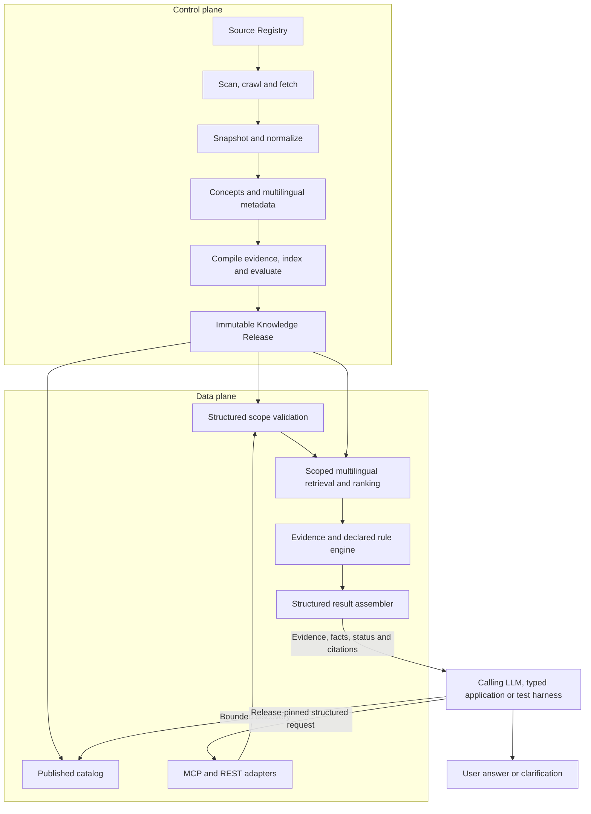
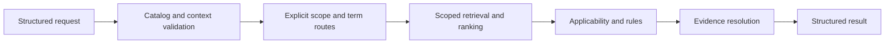
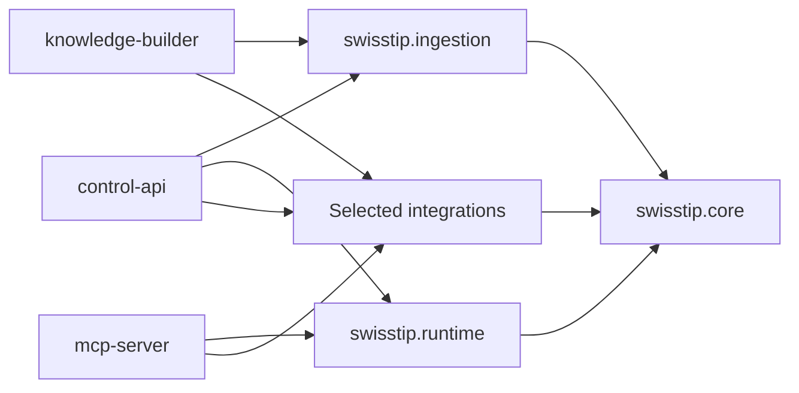
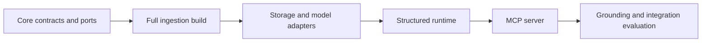
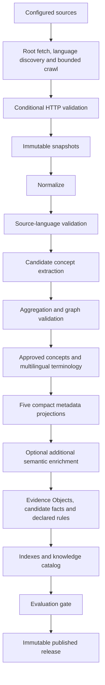
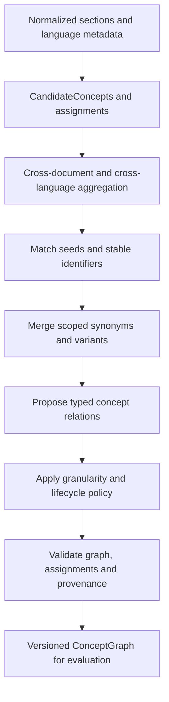
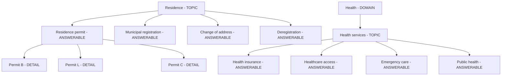
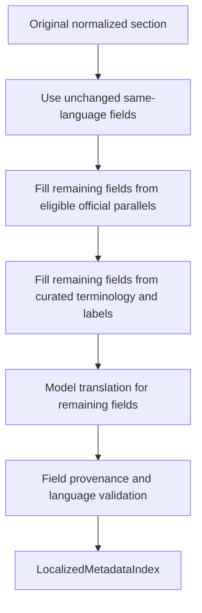
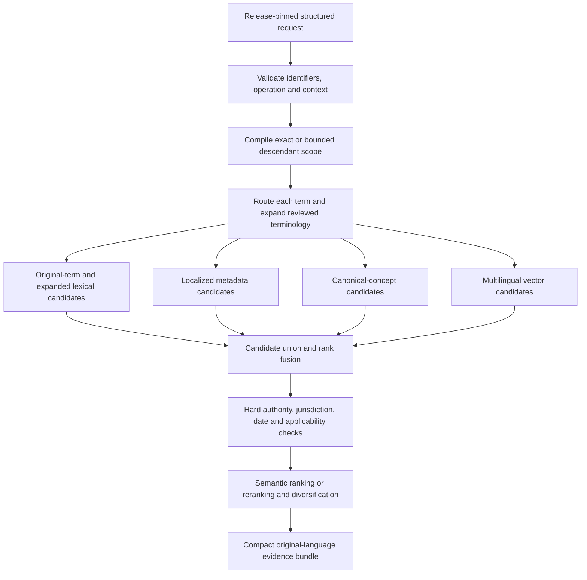
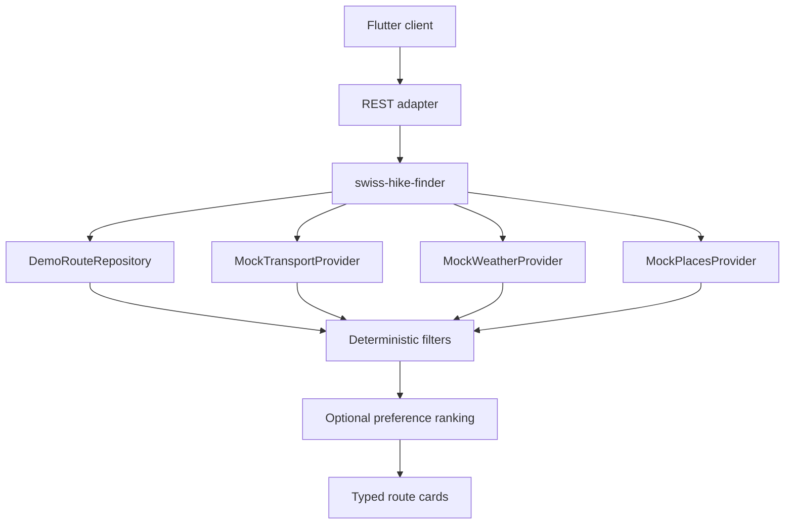

# Swisscom Trusted Information Platform
## Technical & Solution Architecture Specification - V11

**Hackathon:** Swiss Grounding MCP<br>
**Product and functional specification:** [`product-functional-specification.md`](../product/product-functional-specification.md)<br>
**Preferred semantic model:** Apertus<br>
**Model strategy:** pluggable and model-independent<br>
**Example MCP client:** OpenCode

---

# 1. Purpose

This document defines the implementation architecture and technical choices for the Trusted Information Platform (TIP). Functional scope, user-visible behaviour, priorities and product evolution are defined in the product and functional specification.

The immediate technical outcome is a reproducible MCP server that Swisscom can run through its evaluation harness and standards-compatible MCP clients. This hackathon implementation is a vertical slice of the target product: it must be narrow enough to deliver while preserving the contracts, boundaries and traceability needed for further product evolution.

V11 adds build-time source-structure, candidate-assessment and evaluation requirements whose implementation remains pending. The document revision does not change the structured MCP contract or its schema versions, supported operations, or the P0 five-language projection requirement. Historical extraction retention and assistant-drafted comparisons do not establish that these requirements have been implemented or passed.

---

# 2. Technical Design Principles

Technical decisions are classified as:

| Decision class | Meaning |
|---|---|
| Published challenge constraint | Necessary to satisfy the documented Swiss Grounding MCP brief |
| Team MVP choice | Chosen implementation for the hackathon vertical slice |
| Product-enabling design | Included now because it validates or protects a target-product capability |
| Target-product capability | Part of the product vision but not implemented during the hackathon |

1. The MCP server is the primary deliverable and must run independently of optional applications.
2. Stable authoritative information is compiled before request time.
3. Live information is accessed through registered provider interfaces.
4. Raw source snapshots and published releases are immutable.
5. Deterministic code handles dates, hashes, filtering, thresholds and explicit rules.
6. The caller interprets user questions, selects published identifiers, collects context and composes answers. The MCP validates structured requests and returns evidence and published facts or rule results.
7. Build-time models propose classifications, concepts and multilingual metadata; runtime semantic retrieval and ranking stay within caller-supplied scope. Cross-language terminology expansion and retrieval do not require the caller to translate terms into a common language.
8. Concept extraction occurs after deterministic acquisition and produces candidates before governed aggregation and promotion.
9. A published, versioned catalog exposes domains, topics, concepts, supported operations and required context; explicit scope controls descendant traversal.
10. Full source content remains in its original language; compact metadata projections provide bounded multilingual lexical retrieval.
11. Each retrieval term carries its own language tag. Reviewed generic German, German (Germany) and Swiss German profiles route to Swiss Standard German metadata; the caller controls final-answer language.
12. Retrieval returns a small evidence bundle rather than an uncontrolled document dump.
13. Original-language evidence remains authoritative; localized retrieval metadata is derivative and cannot support a factual claim.
14. Every result is traceable to source versions and processing metadata.
15. Refresh, cache state and source failures are observable.
16. All model, storage and client integrations are replaceable behind explicit interfaces.
17. The vertical slice should validate target-product concepts without implementing the entire target product.
18. Future commercial and autonomous capabilities influence contracts only where that does not endanger MVP delivery.

---

# 3. System Architecture

**Decision class: Product-enabling design, implemented as a focused team MVP choice**



The runtime data plane reads only published releases. A failed build must not invalidate or replace the last successful release.

---

# 4. Recommended Hackathon Stack

**Decision class: Team MVP choice**

| Concern | Recommended implementation | Notes |
|---|---|---|
| Backend language | Python | One backend language for ingestion, retrieval, evaluation, MCP and REST |
| Metadata, evidence, facts, releases and tests | PostgreSQL | Single durable operational store |
| Semantic retrieval | pgvector | Replaceable vector-store adapter |
| Lexical retrieval | PostgreSQL full-text search | Avoids another search service for the MVP |
| Raw snapshots | MinIO or filesystem | Immutable content-addressed objects |
| Semantic model | Apertus preferred | Accessed through a provider interface |
| Agent interface | MCP | Primary challenge deliverable |
| Structured application interface | REST | Secondary interface over the same runtime |
| Admin GUI (P1) | React, TypeScript, Vite and Mantine | Control API client; see section 16 for supporting libraries and initial screens |
| Control API (P1) | FastAPI and Pydantic | Python API contracts with a generated TypeScript SDK |
| Reference validation client | OpenCode as one example | The server must not depend on OpenCode-specific behaviour |

These are implementation recommendations, not challenge requirements. A simpler substitute is valid if it reduces delivery risk or demonstrably meets the evaluation criteria better. Replaceable adapters protect the target product from becoming permanently coupled to hackathon technology choices.

---

# 5. Backend Language Comparison and Decision

**Decision class: Team MVP choice with long-term architectural implications**

## 5.1 Decision drivers

The relevant decision is not which language can implement an MCP server; both Python and TypeScript can. The decision should optimize the difficult parts of TIP:

- heterogeneous website, document and dataset ingestion;
- normalization and evidence compilation;
- semantic processing and Apertus experimentation;
- hybrid lexical/vector retrieval;
- grounding and evaluation workflows;
- typed MCP and REST contracts;
- delivery speed during the hackathon;
- a credible evolution path to the target product.

The official MCP SDK catalogue currently classifies both Python and TypeScript as Tier 1. Both support MCP servers and clients, local and remote transports, and protocol-level type safety. MCP capability is therefore not a reason to prefer one over the other. See the [official MCP SDK list](https://github.com/modelcontextprotocol/modelcontextprotocol/blob/main/docs/docs/2026-07-28/sdk.mdx).

## 5.2 Comparison

| Criterion | Python | JavaScript/TypeScript | Assessment for TIP |
|---|---|---|---|
| MCP support | Official SDK, FastMCP, structured output, standard transports and Pydantic types | Official SDK, typed tools, Standard Schema/Zod and standard transports | Equivalent for the required server |
| Source acquisition | Strong HTTP, parsing, PDF, document and data-processing ecosystem | Excellent HTTP and browser automation ecosystem | Python has the advantage for heterogeneous documents |
| Semantic and AI work | Native ecosystem for embeddings, NLP, evaluation and local models | Strong for remote model APIs | Python has the advantage |
| Apertus | Direct Transformers integration and local-model path | Normally accessed through an inference API | Python has the advantage if experimentation extends beyond HTTP calls |
| Contract modelling | Pydantic runtime validation and JSON Schema generation | Strong compile-time types plus runtime validation with Zod or another Standard Schema provider | TypeScript is stricter at compile time; both are suitable at system boundaries |
| PostgreSQL and pgvector | Psycopg, SQLAlchemy, asyncpg and official pgvector integration | node-postgres and broad ORM/query-builder support with official pgvector integration | Equivalent for this design |
| Concurrent network I/O | `asyncio`/AnyIO are well suited to I/O-bound acquisition and service work | Node's event loop is excellent for high-concurrency I/O | Equivalent for hackathon load |
| CPU-heavy parsing or local inference | Direct access to native data/ML libraries and process workers | CPU work must be kept off the Node event loop | Python has the advantage |
| Evaluation and experimentation | Strong testing, notebooks and analytical tooling | Capable general testing ecosystem | Python has the advantage for grounding experiments |
| Web frontend reuse | Requires generated TypeScript types or clients | Can share language and selected schema code with web clients | TypeScript has the advantage |
| End-to-end hackathon simplicity | One language covers ingestion, AI, retrieval, MCP and REST | Excellent if all models are remote and the team is TypeScript-first | Python has the advantage when team skill is comparable |
| Future control-plane development | Suitable with FastAPI and generated OpenAPI | Attractive for web-heavy control planes and BFFs | Slight TypeScript advantage, but not decisive for the core |

Supporting implementation facts:

- The [official Python MCP SDK](https://github.com/modelcontextprotocol/python-sdk/blob/main/docs/get-started/installation.md) uses Pydantic for protocol models and schema validation, AnyIO for asynchronous execution, and supports standard HTTP and stdio use cases.
- The [official TypeScript MCP server guide](https://github.com/modelcontextprotocol/typescript-sdk/blob/main/docs/get-started/first-server.md) provides typed tool registration, schema validation and stdio/HTTP operation.
- FastAPI can generate JSON Schema, OpenAPI and interactive documentation from Pydantic models, allowing Python contracts to generate TypeScript clients rather than being maintained twice. See the [FastAPI request-model documentation](https://fastapi.tiangolo.com/tutorial/body/).
- The official pgvector ecosystem supports both [Python](https://github.com/pgvector/pgvector-python) and [Node.js/TypeScript](https://github.com/pgvector/pgvector-node), so vector storage does not determine the language.
- Apertus has direct support through the Python Transformers ecosystem; see the [Apertus Transformers documentation](https://huggingface.co/docs/transformers/model_doc/apertus).

## 5.3 Decision

Python is selected for the hackathon backend because TIP's primary complexity lies in source and document acquisition, semantic processing, retrieval and evaluation. The official Python MCP SDK provides the required protocol capability, while Python gives the clearest path to Apertus and the broader AI/data ecosystem.

The implementation boundary is:

| Language and priority | Responsibilities |
|---|---|
| Python - P0 backend, P1 REST adapter | Source acquisition, normalization, evidence compilation, retrieval, deterministic rules, model providers, evaluation, MCP and REST |
| TypeScript - optional P1 clients | Admin Control Plane and Arrival Checklist web client |
| Flutter - optional P2 client | Swiss Hike |

REST types and clients for TypeScript applications are generated from the Python OpenAPI contract. Frontends do not import database models or internal domain objects.

## 5.4 Conditions that justify TypeScript instead

TypeScript remains a valid alternative if the implementation team is materially more productive in TypeScript and all of the following hold:

- sources are primarily HTML or JSON rather than difficult document formats;
- Apertus and embedding models are consumed only through remote HTTP APIs;
- the web control plane is a major part of the judged delivery;
- shared frontend development speed outweighs local AI experimentation.

The P0 backend must not be split into a Python ingestion service and a TypeScript MCP gateway. That would add deployment, failure and contract boundaries without improving the judged outcome.

---

# 6. Proposed Python Workspace Structure

**Decision class: Team MVP choice designed for target-product evolution**

The repository uses one Python workspace, one lock file and a small number of internal packages. Package folders use concise boundary names. Published distribution names use the `swisstip-` prefix, while Python imports use the shared `swisstip.*` namespace.

The shared namespace improves readability:

```python
from swisstip.core.evidence import EvidenceObject
from swisstip.ingestion.compilation import EvidenceCompiler
from swisstip.runtime.resolution import Resolver
```

The `swisstip` directory is a Python namespace, not an architectural layer. With implicit namespace packaging, each contributing distribution omits `swisstip/__init__.py` and defines an `__init__.py` only in its component package.

```text
Hackathon2026/
├── README.md
├── LICENSE
├── NOTICE
├── pyproject.toml
├── uv.lock
├── .env.example
├── .gitignore
├── compose.yaml
│
├── docs/
│   ├── product/
│   │   └── product-functional-specification.md
│   ├── architecture/
│   │   ├── technical-specification.md
│   │   └── decisions/
│   │       └── 0001-python-workspace.md
│   ├── challenge/
│   │   ├── coverage-and-limitations.md
│   │   ├── evaluation-plan.md
│   │   └── operations.md
│   ├── strategy/
│   │   └── ubs-challenge-rationale.md
│   └── pitch/
│       ├── first-round-10min.md
│       └── full-presentation.md
│
├── config/
│   ├── sources/
│   │   ├── sem.yaml
│   │   └── zh.yaml
│   ├── products/
│   │   └── swiss-arrival-checklist.yaml
│   └── evaluation/
│       ├── thresholds.yaml
│       └── test-cases.yaml
│
├── packages/
│   ├── core/
│   │   ├── pyproject.toml
│   │   └── src/
│   │       └── swisstip/
│   │           └── core/
│   │               ├── __init__.py
│   │               ├── domain/
│   │               ├── contracts/
│   │               ├── ports/
│   │               └── rules/
│   │
│   ├── ingestion/
│   │   ├── pyproject.toml
│   │   └── src/
│   │       └── swisstip/
│   │           └── ingestion/
│   │               ├── __init__.py
│   │               ├── scanning/
│   │               ├── fetching/
│   │               ├── sources/
│   │               │   ├── sem.py
│   │               │   └── zh.py
│   │               ├── normalization/
│   │               ├── enrichment/
│   │               ├── compilation/
│   │               └── publishing/
│   │
│   ├── runtime/
│   │   ├── pyproject.toml
│   │   └── src/
│   │       └── swisstip/
│   │           └── runtime/
│   │               ├── __init__.py
│   │               ├── planning/
│   │               ├── retrieval/
│   │               ├── search/
│   │               ├── applicability/
│   │               ├── resolution/
│   │               └── assembly/
│   │
│   └── integrations/
│       ├── pyproject.toml
│       └── src/
│           └── swisstip/
│               └── integrations/
│                   ├── __init__.py
│                   ├── postgres/
│                   ├── snapshot_store/
│                   └── models/
│                       ├── apertus/
│                       └── fallback/
│
├── apps/
│   ├── knowledge-builder/
│   │   ├── pyproject.toml
│   │   └── src/
│   │       └── swisstip/
│   │           └── builder/
│   │               ├── __init__.py
│   │               ├── main.py
│   │               ├── bootstrap.py
│   │               └── cli.py
│   │
│   ├── mcp-server/
│   │   ├── pyproject.toml
│   │   └── src/
│   │       └── swisstip/
│   │           └── mcp_server/
│   │               ├── __init__.py
│   │               ├── main.py
│   │               ├── bootstrap.py
│   │               └── tools/
│   │                   ├── resolve.py
│   │                   ├── get_evidence.py
│   │                   └── get_coverage.py
│   │
│   ├── control-api/
│   │   ├── pyproject.toml
│   │   └── src/
│   │       └── swisstip/
│   │           └── control_api/
│   │               ├── __init__.py
│   │               ├── main.py
│   │               └── routes/
│   │
│   ├── admin-console/
│   ├── arrival-checklist/
│   └── swiss-hike/
│
├── schemas/
│   ├── mcp/
│   ├── domain/
│   └── rest/
│
├── migrations/
│   └── versions/
│
├── tests/
│   ├── unit/
│   ├── integration/
│   ├── contract/
│   │   └── mcp/
│   ├── end_to_end/
│   └── fixtures/
│
├── evaluation/
│   ├── golden/
│   ├── grounding/
│   ├── efficiency/
│   ├── freshness/
│   └── reports/
│
├── data/
│   ├── demo/
│   │   └── hiking/
│   └── runtime/
│
└── docker/
    ├── server.Dockerfile
    └── entrypoint.sh
```

## 6.1 Distribution and import names

| Folder | Distribution name | Python import |
|---|---|---|
| `packages/core` | `swisstip-core` | `swisstip.core` |
| `packages/ingestion` | `swisstip-ingestion` | `swisstip.ingestion` |
| `packages/runtime` | `swisstip-runtime` | `swisstip.runtime` |
| `packages/integrations` | `swisstip-integrations` | `swisstip.integrations` |
| `apps/knowledge-builder` | `swisstip-knowledge-builder` | `swisstip.builder` |
| `apps/mcp-server` | `swisstip-mcp-server` | `swisstip.mcp_server` |
| `apps/control-api` | `swisstip-control-api` | `swisstip.control_api` |

Concise folder names avoid repeating the product name throughout the repository. Distribution names retain the product prefix for package-manager clarity, and the shared import namespace makes component boundaries explicit. Concatenated imports such as `swisstipcore` are not used.

## 6.2 Package responsibilities

### `swisstip.core`

Contains the stable shared language of the product:

- domain objects and value types;
- Pydantic contracts;
- statuses and Trust Envelope;
- repository and provider protocols;
- deterministic domain rules.

It imports neither MCP, FastAPI, PostgreSQL, Apertus, document parsers nor other internal packages.

### `swisstip.ingestion`

Implements the control-plane knowledge compiler:


It owns build-time candidate extraction, concept aggregation and graph validation and may use heavier parsing and semantic dependencies. It depends on `swisstip.core` and never on `swisstip.runtime`.

### `swisstip.runtime`

Implements the published-release structured resolution engine:



It consumes only the catalog and concept graph published with the requested immutable release. It depends on `swisstip.core` and never on `swisstip.ingestion`. This prevents request-time resolution from invoking crawlers, candidate extraction, aggregation or other build logic.

### `swisstip.integrations`

Implements the storage and model ports declared by `swisstip.core`. Optional dependency groups should prevent source-parsing or local-model dependencies from being installed into the MCP runtime unless they are required.

## 6.3 Deployable applications

- `knowledge-builder` is a CLI or one-shot job that composes ingestion with source, storage and model integrations.
- `mcp-server` is a thin protocol adapter over runtime use cases. It contains MCP registration and translation, not grounding rules.
- `control-api` is a P1 FastAPI application for build initiation, evidence inspection, releases and structured Information Products.
- `admin-console` is a P1 React/TypeScript application built with Vite and Mantine, consuming the Control API through a generated SDK.
- `arrival-checklist` is a P1 TypeScript client of the Control API.
- `swiss-hike` is the P2 Flutter client.

Suggested executable entry points are defined in their owning application distributions:

```toml
[project.scripts]
swisstip-builder = "swisstip.builder.cli:main"
swisstip-mcp = "swisstip.mcp_server.main:main"
swisstip-api = "swisstip.control_api.main:main"
```

## 6.4 Dependency direction



The enforced dependency rules are:

| Package or application | Permitted internal dependencies |
|---|---|
| `swisstip.core` | None |
| `swisstip.ingestion`, `swisstip.runtime`, `swisstip.integrations` | `swisstip.core` |
| `knowledge-builder` | Core, ingestion and selected integrations |
| `mcp-server` | Core, runtime and selected integrations |
| `control-api` | May compose both build and runtime capabilities |

Ingestion and runtime communicate through published release contracts and storage, not through direct package imports.

## 6.5 Split criteria and restraint

The package split is justified by different dependencies, execution profiles and failure behaviour:

| Concern | Knowledge builder | MCP server |
|---|---|---|
| Lifetime | Batch job | Long-running service |
| Workload | Crawling, parsing, embedding and indexing | Low-latency reads and resolution |
| Dependencies | Document parsers and model tooling | MCP, retrieval and database client |
| Failure policy | Preserve the previous release | Continue serving the previous release |
| Scaling | Occasional compute-heavy work | Concurrent request handling |
| Network access | Outbound access to approved sources | Restricted runtime access |

Do not create separate packages for each source connector, MCP tool, domain object, storage technology or Information Product. Marketplace, billing and entitlement packages are added only when those target-product capabilities acquire implementation, ownership or deployment needs.

The workspace initially uses one repository, one lock file and one versioning policy. Packages are not independently published or versioned during the hackathon.

## 6.6 Hackathon implementation order

The P0 implementation path is:



The initial deployables are the one-shot `knowledge-builder` and long-running `mcp-server`. The Control API, web clients and Flutter client remain P1/P2 consumers of the same packages.

---

# 7. Semantic Model Strategy

**Decision class: Team MVP choice with a product-enabling provider boundary**

## 7.1 Preferred provider

Apertus is the preferred candidate for build-time semantic preparation because it supports the Swiss and sovereign-AI positioning. The [official Apertus launch](https://ethz.ch/en/news-and-events/eth-news/news/2025/09/press-release-apertus-a-fully-open-transparent-multilingual-language-model.html) describes multilingual training that includes Swiss German and Romansh. Training coverage motivates evaluation; it does not establish TIP coverage. The [official Apertus FAQ](https://www.apertus-ai.org/docs/faq/) recommends evaluation or fine-tuning for specific language needs.

Suitable uses include source classification, candidate concept and terminology extraction, proposed applicability annotations, compact metadata projection preparation and evidence reranking where evaluation supports that provider. Applicability annotations require validation before publication; runtime applicability uses declared fields and published rules. The caller owns user-language interpretation, intent recognition, jurisdiction disambiguation, conversational clarification and answer composition.

Apertus is a semantic provider in this architecture, not implicitly the vector-embedding model. A separately configured multilingual `EmbeddingProvider` supplies vectors unless an Apertus-derived embedding implementation independently passes retrieval evaluation. TIP does not expose runtime generative answers or a translation service in P0.

## 7.2 Model independence

Model-assisted preparation and bounded semantic ranking use `SemanticModelProvider`; vector generation uses `EmbeddingProvider`. Compatible alternatives can be configured when Apertus is unavailable, unsuitable or outperformed. Every configured runtime provider and fallback must be evaluated for the selected release profile. Runtime ranking may vary with provider execution; explicit scope validation and applicability checks remain deterministic.

Each semantic artifact records:

```text
provider
model identifier and version
operation
prompt/template version where applicable
generation timestamp
input content hash
output content hash
```

Release manifests also pin embedding/index versions, ranking configuration and permitted fallback profiles. A required projection-provider failure blocks publication and preserves the previous release. At runtime, a failed vector or reranking provider may use only an evaluated fallback and must report the degradation and channels executed. If no permitted execution path can complete, return a typed tool error; provider failure is not evidence that the requested knowledge is unsupported. Provider changes require regression evaluation before promotion.

## 7.3 Multilingual capability contract

Five-language compact metadata projections and scoped multilingual lexical, concept and vector retrieval with semantic ranking/reranking are P0. The caller supplies stable scope identifiers and may retain extracted words or short phrases in their original supported languages. It need not translate them into English, a common language or an original-source language.

The platform-approved catalog is closed and versioned as `tip-language-catalog/v3`. Version 3 uses language-only identifiers for retrieval-term, source and projection roles. Jurisdiction belongs in structured scope; regional terminology, dialects and idioms belong in reviewed profiles and provenance:

| Language profile | Approved retrieval-term tags | Projection route | Exact source tag |
|---|---|---|---|
| English | `en` | `en` | `en` |
| German | `de` | `de`; reviewed terminology for input variants | `de` |
| French | `fr` | `fr` | `fr` |
| Italian | `it` | `it` | `it` |
| Romansh | `rm` | `rm`, with declared standard/idiom profile | `rm` |
| Swiss German | `gsw` | `de` with reviewed dialect aliases | None |

The catalog enumerates terminology sets, dialect/idiom profiles and source-language detector mappings. Source declarations require exact language-only source tags; the v3 term-language and source-declaration alias sets are empty. `fr`, `it` and `rm` are supported catalog tags, subject to release-level evaluation. `gsw` identifies Swiss German as a language, with evaluated dialect coverage declared separately. This contract does not run a whole-question language detector.

Tags are parsed case-insensitively and emitted with canonical BCP 47 casing, so `DE` becomes `de`. Matching is exact after canonicalization. Regional tags are not public language profiles. Raw website or detector tags retain their original specificity in provenance and require explicit reviewed mappings to enabled language-only source tags. The syntax parser does not silently strip subtags or establish coverage.

A release can enable an evaluated subset of the platform catalog, but cannot introduce tags, aliases, source languages, projection languages, dialects or idioms. Provider capabilities, environment variables and source configuration do not expand coverage. Adding a capability requires a new catalog version and release-gating evaluation. The hackathon P0 target is complete compact projections in `en`, `de`, `fr`, `it` and the declared `rm` form for every included P0 section; a release may claim only its passing evaluated profiles.

A `LanguagePolicy` must be referentially closed: term-language aliases remain empty, every term-to-projection route targets an enabled projection, every source mapping targets an enabled source language, and every declared term/source/projection combination references a passing coverage profile. No cross-product of independently listed languages implies coverage. Unsupported combinations cannot become enabled by model output.

The mandatory path combines reviewed multilingual terminology, routed compact projections, original-term lexical retrieval, canonical-concept retrieval, multilingual vector candidates and semantic ranking or reranking within hard scope constraints. Known P0 concepts also have evaluated identifier/lexical paths so semantic-provider degradation does not silently erase them. A term route selects retrieval metadata and never an implicit source-language filter. Multiple supported language entries are routed independently; there is no carrier language, whole-question mixed-language classifier, fixed answer-language mapping or mandatory English fallback.

The principal-scenario matrix evaluates the listed English, German, French, Italian, Swiss German and Romansh term profiles against declared original-source languages. Swiss German dialect and Romansh idiom claims name their tested forms. No-client-translation support applies to those evaluated profiles, not to arbitrary text or unlisted languages. An unsupported term identifies the affected entry and supported representations; it is never silently discarded or translated.

---
# 8. Core Components

| Boundary | Components |
|---|---|
| Acquisition | `SourceRegistry`, `SourceScanner`, `SourceFetcher`, `SnapshotStore`, `DocumentNormalizer`, `SourceLanguageValidator` |
| Knowledge preparation | `CandidateConceptExtractor`, `ConceptAggregator`, `ConceptGraphValidator`, `TerminologyRegistry`, `MetadataProjectionBuilder`, `EvidenceCompiler` |
| Publication | `CatalogPublisher`, `ContextSchemaValidator`, `EvaluationRunner`, `ReleasePublisher`, `LanguagePolicyRegistry` |
| Retrieval | `LexicalIndex`, `LocalizedMetadataIndex`, `VectorIndex`, `TermRouter`, `TerminologyExpander`, `EvidenceRetriever`, `EvidenceRanker` |
| Runtime | `CatalogReader`, `StructuredRequestValidator`, `ScopePlanner`, `CapabilityRegistry`, `EvidenceRuleEngine`, `ResultAssembler` |
| Providers and adapters | `SemanticModelProvider`, `EmbeddingProvider`, `McpServer`, `RestApi` |

`ScopePlanner` compiles already supplied selectors and published traversal rules into an execution plan. It does not interpret questions or repair missing selectors. Runtime term expansion provides retrieval signals only. Source-language validation belongs to the builder; no runtime user-question language detector or response renderer is required.

Optional Admin and demo clients consume the same service interfaces. They must not be runtime dependencies of the MCP server.

---

# 9. Shared Contracts

MVP contracts:

```text
SourceDefinition / LanguageDiscoveryRecord / SourceSnapshot / NormalizedDocument
EvidenceObject / CandidateFact / PublishedFact / PublishedRule
LanguagePolicy / RetrievalTerm / TermRoute / RetrievalVariant / RetrievalTrace
ConceptDefinition / CandidateConcept / ConceptAssignment / ConceptRelation / ConceptGraph
TerminologyEntry / TranslationMetadata / LocalizedRetrievalProjection
KnowledgeCatalog / CatalogEntry / CoverageProfile / ContextSchema
KnowledgeRelease / StructuredGroundingRequest / ExecutionPlan
EvidenceBundle / StructuredGroundingResult / TrustEnvelope
CapabilityDefinition / InformationProductRequest / InformationProductResult
```

Key contract contents are:

```text
KnowledgeCatalog
  catalog identifier, immutable release_id, schema version and content hash
  Knowledge Space, domain, topic and concept hierarchy
  stable identifiers, multilingual labels/aliases/descriptions and provenance
  supported finite intents, scope modes and bounded traversal limits
  context schemas, jurisdiction profiles and valid scope combinations
  temporal/language coverage, exclusions, freshness and rule availability
  pagination ordering and release-bound cursor contract

CoverageProfile
  stable coverage_profile_id and release/catalog identity
  knowledge_space_id, domain_id, topic_id and optional concept set
  supported intent, jurisdiction, context_schema_ref and scope modes
  source identifiers, source languages and temporal coverage
  supported term profiles and evaluated term/source/projection routes
  dialect/idiom profiles, projection completeness and evaluation result
  published rule references, exclusions and freshness policy

ContextSchema
  schema identifier/version/hash
  typed fields, allowed values and additionalProperties=false
  conditional required fields and machine-readable reason codes
  constraints, consistency rules and supporting rule/evidence references

LanguagePolicy
  policy identifier, schema version, immutable version and content hash
  platform language catalog identifier and version
  enabled retrieval-term / source / projection language sets
  accepted term tags and explicit operation-scoped aliases
  source detector mappings and source-declaration aliases
  term-to-projection routes and evaluated combinations by coverage profile
  reviewed terminology versions and dialect/idiom profiles
  source-language detector identity, thresholds and override policy
  required projection fields and completeness thresholds
  evaluation suite/version/result and approval status

RetrievalTerm
  text                          bounded original caller-selected term or phrase
  language                      required supported BCP 47 term tag

TermRoute
  input term index and original text
  canonical requested tag, effective term profile and projection route
  reviewed terminology references and allowed source-language set
  route and policy versions

RetrievalVariant
  input term reference, text and language
  declared scope and optional in-scope concept reference
  ORIGINAL / CURATED_ALIAS / MODEL_TRANSLATION / SEMANTIC_EXPANSION method
  terminology or model provenance and applicable route

RetrievalTrace
  requested scope and executed scope, release and coverage profile identifiers
  term routes and effective source-language filter
  channels, index/embedding/model versions and ranking configuration
  candidate/evidence counts, per-channel ranks and rule references
  typed provider degradation and evaluated fallback profile when used

ConceptDefinition
  concept_id, multilingual preferred labels/aliases/descriptions
  concept type and granularity level, domain/topic and jurisdiction scope
  supported intents, context_schema_ref and valid scope combinations
  lifecycle status, owner, relations and schema version

CandidateConcept
  proposed labels, type, granularity, relations and terminology
  candidate identifier/revision, description, scope and example questions
  primary section anchor, supporting source blocks and exact evidence references
  extraction run/provider/model/configuration identities and dependency status
  confidence and validation state

NormalizedSourceBlock
  document/block identity, source snapshot and normalized content hashes
  normalizer version, raw source locator and normalized evidence offsets
  block kind/order, source container/parent/sibling and list-continuation relations
  table row/column/header relationships, original text and scope-conflict/loss flags

SourceContentDecision
  source/build/block/chunk identity, content-policy and processing versions
  inclusion/exclusion/skip disposition, reason code, limits and truncation details

CandidateClaimAssessment
  assessment identifier/schema version, exact candidate and claim revisions
  claim text/scope, cited evidence identities/hashes/offsets and question references
  separate support, scope and completeness judgments with reasons and dependencies
  evaluator identity/type/version, protocol/configuration version and timestamp

ExampleQuestionAssessment
  assessment identifier/schema version, exact candidate revision and question index
  immutable original question, proposed revised question and revision rationale
  cited claim/evidence identities, answerability judgment and unresolved portions
  evaluator identity/type/version, protocol/configuration version and timestamp

ReviewProvenance
  assessment references, assistant/model/human role and review relationship
  primary/second/independent review status and explicitly reported human minutes
  separate model execution/elapsed time, review decisions and correction history

ConceptAssignment
  concept_id and document/evidence identifier
  assignment method/confidence and supporting text spans

ConceptRelation
  source/target identifiers, BROADER / NARROWER / RELATED / SAME_AS
  provenance, confidence and review status

ConceptGraph
  graph identifier/version, concept and terminology versions
  aggregation configuration and validation result

TerminologyEntry
  concept_id, BCP 47 tag, term and normalized term
  WHOLE_TOKEN_CASE_SENSITIVE / WHOLE_TOKEN_SIMPLE_CASEFOLD match mode
  alias type, jurisdiction scope, provenance, review status and version

TranslationMetadata
  source/target languages, provider/model/version
  generation timestamp and original content hash

LocalizedRetrievalProjection
  document/section identifier, source and target languages
  localized title/headings/keyphrases/short synopsis
  canonical concepts, named entities and jurisdiction references
  ORIGINAL_SAME_LANGUAGE / OFFICIAL_PARALLEL / CURATED / MODEL_TRANSLATION method per field
  provider metadata, review/completeness status, failure reason and original hash
```

Every retrieval variant stays within the supplied scope and the requested release policy's term/projection roles. Out-of-policy model variants are discarded and reported as provider-contract failures; they cannot enable a language, select a different concept or change applicability. Reviewed expansion and semantic similarity can rank eligible evidence but never establish the caller's intent or a factual conclusion.

`LanguagePolicy` is shared by ingestion, runtime, MCP, REST, discovery and evaluation. A `KnowledgeRelease` pins the policy, knowledge catalog, context schemas, concept graph, terminology, rules, projections, indexes and provider/ranking configuration by immutable versions and hashes. Any capability or policy change creates a new evaluated release; discovery and resolution must agree on the exact release identity.

Target-product contracts remain `Publisher`, `DataProductDefinition`, `LicensePolicy`, `Entitlement`, `UsageRecord`, `PricingModel` and `SettlementRecord`. At most, the hackathon preserves compatible identifiers and dependency metadata; it does not implement commercial workflows. Every persisted contract includes a schema version.

## 9.1 Concept graph and governance

Canonical concepts use stable, language-neutral identifiers. Labels, translations and aliases may change without changing identity. Published lifecycle states are `CURATED`, `VERIFIED_AUTOMATIC`, `CANDIDATE`, `MERGED`, `DEPRECATED` and `REJECTED`.

Only `CURATED` and `VERIFIED_AUTOMATIC` concepts contribute to declared coverage and selectable identifiers. Candidate annotations may provide a bounded ranking signal on already eligible documents; they cannot validate a selector, widen scope, establish applicability, support a fact or exclude evidence. Merged/deprecated records retain discoverable replacement metadata. The caller must submit a supported current identifier; resolution does not silently follow a replacement into different scope. Rejected candidates retain audit metadata outside runtime indexes.

The graph supports multiple parents and typed `BROADER`, `NARROWER`, `RELATED` and `SAME_AS` edges. Broader/narrower edges must be acyclic; related and equivalence edges are validated separately. A normalized section or Evidence Object can have multiple assignments. Catalog discovery exposes the hierarchy with stable ordering, explicit parent identifiers and bounded pages; it does not require clients to load the entire graph.

Governance is scoped by Knowledge Space. Producers own seed concepts, granularity, operations, context schemas and P0 coverage; reviewers approve curated changes. The immutable release references graph, assignment and terminology versions, extraction provenance and evaluation. Neither stable identifiers nor exact citations prove that an extracted fact includes every required condition.

`VERIFIED_AUTOMATIC` requires the configured, versioned validation and evaluation gates for the exact candidate revision; model confidence, another model's endorsement and resolvable citations alone are insufficient. A material failure in claim support, scope or completeness prevents the affected structured claim from becoming approved knowledge, including through a curated promotion without correction and reassessment. Qualified source excerpts may remain available only through the published scope and evidence policy. Extraction retention, proposal history and candidate lifecycle approval are separate records. Assistant review and a person's second review of their own labels must not be recorded as independent adjudication.

---
# 10. Source Registry and Acquisition

A `SourceDefinition` contains at least:

```text
source_id
canonical authority
base URL and allowed URL patterns
optional language entry URLs and source discovery adapter identifier/version
reviewed website-language hint mappings to declared source tags
crawl page/depth/request/time budgets and sitemap limits
required language entry points or coverage expectations
source type
jurisdiction
declared languages
declared topic coverage
refresh policy
cache policy
robots/source-etiquette policy
enabled state
```

The hackathon operator triggers:

```text
[ BUILD / FULL RELOAD ]
```



### Website language discovery contract

P0 website acquisition starts from the configured base URL and optional entry URLs. Discovery runs on the root response, permitted redirect destinations and every fetched HTML page, before navigation removal during normalization. It uses deterministic parsers and configured source adapters; semantic extraction does not control the crawl frontier.

1. Inspect HTML `link` and `a` elements carrying `hreflang`, HTTP `Link` alternate-language headers, and language-selector anchors or URL-valued `option` elements. Recognize selector labels through a versioned label dictionary and explicit adapter rules; an arbitrary link mentioning a language is not sufficient. Record HTML `lang`, `Content-Language` and redirect destinations as page hints, not as lists of available translations. Treat `x-default` as a default entry URL, never as a source language.
2. Inspect sitemap URLs declared by the source or advertised through `robots.txt`, and make a bounded conventional `/sitemap.xml` probe when permitted. Traverse sitemap indexes within configured limits; extract page URLs and alternate-language links. A sitemap URL without a language hint may enter ordinary scoped crawling, with its language determined after normalization. Record unavailable or truncated sitemap discovery without claiming full-site coverage.
3. Resolve relative links against the response URL and any valid HTML base URL, then apply URL scope and robots checks before every request and redirect hop, including sitemap and adapter requests. A root or selector redirect cannot implicitly admit `www` hosts, sibling subdomains or external hosts. Remove fragments and deduplicate normalized URLs without removing language-bearing paths or query parameters. A canonical link must not collapse distinct language variants. Bound redirect loops and repeated selector links.
4. Preserve advertised tags and labels as raw hints. Canonicalize well-formed tags for comparison; exact enabled source tags or reviewed per-source hint mappings can identify eligible variants. For example, a reviewed mapping from a regional website language hint to an already declared `fr` tag may guide discovery, but it does not create a source-declaration alias or bypass section 10.3 validation. Mapping targets must belong to both the source declaration and candidate policy or configuration validation fails. Conflicting or unmapped hints remain unresolved; URLs with unknown language may be fetched through ordinary scoped crawling for content validation. Explicitly identified variants outside the source declaration or policy are recorded as excluded, without scheduling their language branch. Newly encountered unsupported content is omitted from evidence and reported as a gap.
5. Queue eligible language entry URLs ahead of deeper navigation and use stable round-robin scheduling across discovered language branches, with German first when available. Selecting a single page version for a limited hackathon run prefers a verified German URL; multilingual selections preserve every selected variant. The preference cannot drop another selected language or exhaust the frontier on deeper German pages before other language entry points. All discovery and acquisition requests share the configured traffic and crawl budgets; record pending variants when limits are reached. Language discovery never guarantees exhaustive coverage of a site or equal translation availability for every page.
6. Use the same declared request headers and isolated cookie policy on repeat builds, and record that fetch profile and adapter version. Explicit language URLs are preferred over ambient browser preferences. An observed selector requiring JavaScript, form submission or cookie state without an available adapter is reported as unresolved with `adapter_required`. P0 static discovery does not promise detection of controls absent from returned HTML. A configured adapter may expose additional URLs or bounded language-specific requests, subject to the same scope and budget checks. If multiple variants share a URL, retain the explicit language request profile in fetch identity and snapshot provenance to prevent deduplication or cache reuse across variants.
7. Submit fetched variants to the existing snapshot, normalization and source-language validation pipeline. Alternate-language links propose parallel-content groups; they never establish semantic or revision equivalence on their own. Do not generate alternate URLs by guessing language path substitutions.

Each `LanguageDiscoveryRecord` contains the source/build identifiers, parent response or sitemap reference and hash, discovery mechanism, raw advertised tag/label, nullable mapped source tag, resolved candidate URL, request-profile identifier, redirect chain, fetch/snapshot reference when available, and nullable validated effective language. For unresolved selectors without a URL, the candidate URL is nullable and an element locator identifies the control. Its disposition is `DISCOVERED`, `QUEUED`, `FETCHED`, `VALIDATED`, `EXCLUDED`, `FAILED` or `UNRESOLVED`, with decision history and reason codes such as `outside_scope`, `robots_disallowed`, `language_not_declared`, `language_not_enabled`, `unmapped_hint`, `adapter_required`, `fetch_failed`, `language_quarantined` and `budget_exhausted`. A fetched page becomes `VALIDATED` only after source-language validation; this does not itself establish published coverage.

The build report groups records by advertised and validated language, lists entry URLs and acquisition outcomes, and exposes `COMPLETE_WITHIN_SCOPE`, `PARTIAL` or `FAILED` discovery status with the scope, mechanisms attempted, budgets and outstanding limitations. `COMPLETE_WITHIN_SCOPE` means the configured static/adapter discovery frontier was exhausted, not that all languages on the live site are known. Unresolved observed selectors, failed discovery inputs or exhausted budgets make discovery `PARTIAL`; inability to inspect any configured entry point makes it `FAILED`. An absent conventional sitemap alone is a reported limitation, not a discovery failure; failure to read an advertised or configured sitemap makes discovery partial. Required language entry points and coverage expectations are explicit source configuration: failure to discover, fetch or validate them blocks release promotion. Other gaps remain visible and cannot contribute to claimed coverage; the last successful release remains active when promotion fails.

## 10.1 Concept compilation

Source planning may record candidate `parallel_page_groups` with `alignment_status=NOT_EVALUATED`. These relationships identify configured entry pages for later comparison; they must not propagate to arbitrary child pages or be treated as evaluated semantic alignment. The current catalogue planner preserves selected source IDs, schedules German seeds first and budgets each eligible seed independently. It does not yet implement the root discovery scheduler above.

Compilation keeps source/document, snapshot, normalized section and evidence identities distinct across language versions. Only reviewed alignment can map their supported concepts to shared stable language-neutral concept IDs. A shared concept assignment does not establish claim equivalence: two sections may describe the same concept with different conditions, dates or coverage. Verified parallel-section mappings must bind exact snapshot/section references, review provenance and revision compatibility; a changed source revision requires revalidation before reusing the mapping.

Concept compilation is a build-time semantic process over immutable normalized content. It is not executed by `SourceScanner` or `SourceFetcher` and never changes a source snapshot.



Candidate extraction records the exact normalized section and text span supporting each proposal. Apertus may propose concepts, labels, relations and multilingual terminology through `SemanticModelProvider`. Deterministic matching handles known identifiers and reviewed terminology. Corpus aggregation considers labels, multilingual embeddings, shared evidence, source structure and jurisdiction, but no similarity threshold alone may merge or promote a P0 concept.

Granularity is policy-driven rather than a fixed tree depth:

```text
DOMAIN      top-level coverage, for example Immigration or Health
TOPIC       broad navigation or journey, for example Residence
ANSWERABLE  independent action, obligation or question with evidence
DETAIL      subtype, deadline, exemption or other precise fact
```

`ANSWERABLE` is the default retrieval and grounding unit. Split a candidate when user action, authority, applicability, deadline, legal effect, required documents, authoritative source or independently meaningful question differs. Merge candidates when they are translations, synonyms, spelling variants, abbreviations or dialect variants of the same scoped object.

Examples:



Municipal conduct rules may be related to residence or living in a municipality, but are not automatically children of `Residence permit`. A model suggestion is a candidate relation until it meets configured validation or receives review.

### 10.1.1 Logical source blocks and content policy

Normalization preserves ordered logical source blocks as well as display headings. Paragraphs, list introductions/items and continuations, table rows/columns and their headers, and source container/parent/sibling relationships retain stable identities within the normalized version. HTML records DOM relationships; other supported formats record their applicable structure without inventing a DOM. A heading inserted inside a list must not detach its resumed conditions from their governing introduction. A table row retains the associations between its category, affected population, duration and other cells.

Each block links to the immutable raw snapshot and its locator, the normalized document/hash, and the normalizer version. Evidence references identify the exact normalized text representation and use zero-based, end-exclusive Unicode code-point offsets; raw byte positions or DOM locators are recorded separately rather than treated as interchangeable offsets. Normalization does not rewrite source wording to repair meaning. Suspected loss of substantive blocks or relationships, or a heading whose inherited population conflicts with the body, is flagged with the affected identities. Material unresolved loss or scope conflict prevents the affected structured claim from passing validation; a heading alone cannot override explicit body scope.

The Knowledge Space defines a versioned source-content policy before extraction. In-scope actionable contact, authority and procedure facts remain eligible even under a contact heading; a heading keyword alone cannot classify them as page furniture. Navigation, duplicated general contact chrome, unrelated embedded news and generic links may be excluded when the policy supplies a specific reason. Duplicate suppression links to the retained equivalent occurrence and cannot remove the only evidence for an included fact. The report records included/excluded sections, skipped chunks and budget limits separately, with reason codes such as `navigation_furniture`, `duplicate_contact_chrome`, `outside_scope`, `generic_link_only`, `budget_exhausted`, `normalization_loss` and `unresolved_dependency`. Every decision names its source blocks, processing stage and policy version. Exclusion, lack of a proposal, structural rejection and semantic rejection are distinct outcomes.

### 10.1.2 Evidence dependencies and bounded extraction

The primary section anchors a candidate; it does not prohibit necessary supporting evidence from other sections. A candidate may cite bounded related blocks that establish its heading context, governing conditions, exceptions or continued procedure. Each span must resolve to its own immutable source identity and be assessed for the candidate's population, action, jurisdiction and time scope. Sharing a label or adjacent DOM container does not permit importing conditions from a sibling population or procedure. Necessary cross-source dependencies retain their own authority and revision identities and require an explicit, validated relationship.

Chunking uses the logical block relationships to preserve governing introductions, complete conditional lists and associated table cells, or supplies explicit dependency references when configured limits require a split. Per-chunk concept limits, input/output limits and per-page/run request budgets are recorded. If required context cannot fit or cannot be acquired within the authorized build scope, the candidate records the unresolved dependency and the affected coverage gap. Truncation or an exhausted output budget cannot silently turn a partial condition list into a complete claim. A later evidence addition or corrected claim creates a new revision for reassessment; it does not retroactively repair the original proposal or its score.

The proposal ledger retains every retained and rejected proposal with its run, candidate revision, cited evidence, processing stage and reason-coded decision history. Corpus comparison searches the fixed set of pages and both retained and rejected proposals before classifying an expected claim as never proposed. Standalone, embedded and distributed representations are recorded separately. Coverage from retained proposals is assessed independently: a rejected-only representation is missing from retained coverage, and related or partially retained claims do not earn complete coverage merely because a source section or label matches.

### 10.1.3 Claim and example-question assessment

Assessment is a versioned build contract, separate from extraction confidence and source-location validation. Each material claim receives separate support, scope and completeness judgments against its exact candidate revision, intended operation and cited evidence. Every example question proposed for the included candidate/operation receives its own answerability judgment, including questions not matched to a reference concept; an overall candidate verdict cannot substitute for question-level assessment. An unsupported question cannot be published as a supported coverage example: omit or revise it in a new assessed revision while retaining its original history. Records preserve the original question, any proposed revision and its reason, exact claim/evidence identities, evaluator identity and role, evaluation protocol/configuration and timestamps. Human decisions and explicitly reported review minutes remain separate from assistant suggestions, model execution time and elapsed session time; absent human values remain unset.

The assessment checks material conditions and exceptions, affected populations and actor roles, AND/OR structure, negation, strict/inclusive numeric boundaries, units, reference windows and deadline starting events. It distinguishes prerequisite authorization from permit issuance, quota status, registration duties and the format or replacement of a residence document. Examination conditions do not become guarantees of approval. Unsupported definitions, proof-document checklists, deadlines and consequences cannot be inferred from a topic mention or link title.

A question is assessed against the saved candidate and its cited evidence, with gaps identified separately when the claim is stated but its support is uncited. A relevant uncited paragraph may identify a proposed correction, but cannot silently supply an answer or complete the original assessment. Conversely, a complete citation does not mean the candidate description preserved all its conditions. Additional questions about documents, impediments or procedures require their own supported scope; broad individualized questions are not accepted merely because a narrower source-level question can be answered.

Source ambiguity and missing user context are different records. An unresolved source boundary, contradiction or undefined relationship between alternatives cannot be converted into a deterministic applicability rule by asking for more personal facts. Preserve the unresolved source portion until reviewed evidence resolves it. `NEEDS_CONTEXT` remains reserved for missing declared user facts within a supported operation and context schema. The assessment protocol records primary review, same-person second review and independent adjudication distinctly and does not infer independence from using a second model or an assistant.

## 10.2 Localized retrieval projection compilation

Every eligible section uses the common projection schema and required target languages while retaining its own values and source provenance. Shared labels, aliases, projection keys or canonical concept IDs do not collapse documents, sections or evidence identities. A projection for one original section cannot copy unsupported claims from a same-topic translation; official parallel text must satisfy the alignment and revision checks below.

The builder creates compact search projections instead of machine-translating complete pages. Each included normalized section retains its original text and receives localized title, heading, keyphrase and short-synopsis fields for the configured projection languages.



The field precedence is `ORIGINAL_SAME_LANGUAGE`, then `OFFICIAL_PARALLEL`, then `CURATED`, then `MODEL_TRANSLATION`. `ORIGINAL_SAME_LANGUAGE` copies the normalized field unchanged when source and target language are the same. Official content is linked through source provenance rather than copied without identity. Model-derived fields record provider, model, generation timestamp, original content hash and review status. Authorities, jurisdiction identifiers, dates, numeric values, canonical concept identifiers and other language-neutral structured values are copied without translation.

The required P0 projection target is:

```text
en
de
fr
it
rm
```

The `rm` configuration declares Rumantsch Grischun and any additional evaluated idioms. German terms use `de` across regional terminology variants; reviewed terminology remains scoped to the selected concept and jurisdiction. Swiss German (`gsw`) does not receive an automatic document-wide metadata projection because it has no single standardized written form. Its reviewed dialect aliases provide scoped retrieval signals associated with canonical concepts and Swiss Standard German terminology. Both term languages search the `de` projection alongside original-term lexical, concept and vector channels. They impose no language on the caller's final answer.

Projection records are derived retrieval artifacts and cannot support a fact or serve as cited evidence. The original section or an official parallel-language section remains the evidence target. Projection generation is cached by original content hash and provider/configuration version so unchanged content is not translated again.

Every projection field records `COMPLETE`, `OMITTED_NOT_REQUIRED` or `FAILED` and its method. The active `LanguagePolicy` defines the required title, heading, keyphrase and synopsis fields for each P0 section and projection language. Missing or failed required fields, a target language outside the policy, or a generated field that fails language validation blocks release promotion. Non-P0 omissions are permitted only when they are declared as coverage gaps and excluded from the corresponding coverage profile. A projection-provider failure never downgrades the requirement silently: the candidate release fails and the last successful release remains active.

## 10.3 Source-language normalization and validation

Source-language processing is governed by the candidate release's `LanguagePolicy`:

- A `SourceDefinition` may declare only exact source tags enabled by the policy. The v3 source-declaration alias set is empty, so only `en`, `de`, `fr`, `it` and `rm` can be declared before release-level filtering. A malformed tag is a configuration error; a well-formed tag outside the policy is unsupported and blocks the build.
- The builder stores raw website tags, source declarations, detector results, confidence, reviewed normalization mappings and effective source language separately. Source declarations and effective languages use language-only codes. Regional website hints or detector outputs may map to an enabled source language only through an explicit reviewed mapping; provenance retains the original tag. There is no implicit regional fallback or jurisdiction inference.
- A high-confidence conflict between declared and detected language quarantines the affected section until a reviewed override resolves it. A low-confidence or unknown language is also quarantined. Required quarantined content blocks release promotion; optional content is omitted and reported as a coverage gap.
- A mixed-language page is segmented at stable section boundaries. Each publishable `EvidenceObject` has one effective source language and retains a reference to the unchanged mixed-language snapshot. A section that cannot be separated or confidently assigned is quarantined rather than assigned to its dominant language.
- Invalid byte sequences, replacement-character damage or other material encoding corruption fails normalization for the affected section. The builder does not translate, repair by model inference or publish corrupted text as evidence.
- Official parallel pages are independent versioned sources linked by a parallel-content group. Retrieval time, source-reported revision, effective date and content hash are compared per language; URL similarity alone never establishes equivalence. A stale or substantively divergent parallel page cannot supply `OFFICIAL_PARALLEL` fields for a newer section. The builder instead uses an eligible curated or model-derived projection, or fails the projection gate, while citations continue to target the actual original-language evidence.

All quarantine, override and parallel-version decisions are included in the build report and release evaluation record.

Scheduled and incremental Knowledge CI/CD is a target-product capability, not part of the hackathon implementation. The MVP should nevertheless use ETag, Last-Modified and content hashes where available, record the last attempted and successful refresh, respect source rate limits, and expose failures without removing the previous release. This validates the lifecycle metadata on which later automation depends.

---

# 11. Snapshot and Release Model

Raw source responses are stored as immutable, content-addressed `SourceSnapshot`s with:

```text
canonical URL
retrieval timestamp
HTTP status and relevant headers
source-reported modification time
media type and language
content hash
raw-object location
fetch/build identifier
```

`NormalizedDocument` and `EvidenceObject` records contain at least `declared_language`, `detected_language`, `effective_source_language`, `language_detection_method`, confidence, any reviewed override, `canonical_concept_ids` and the original text or an immutable reference to it. A source may declare several languages while each published evidence object has exactly one effective source language from its release policy.

A `KnowledgeRelease` references the exact snapshots, normalized documents, evidence objects, knowledge catalog, context schemas, concept graph, terminology, published facts/rules, projections, indexes, schema versions, provider/ranking configuration, evaluation result and immutable `LanguagePolicy` identifier, version and content hash used to create it. The runtime serves that exact release when requested, even if another release becomes active; unavailable releases return `RELEASE_UNAVAILABLE`.

Only a release that passes the configured evaluation gate can become the active release.

---

# 12. Storage and Retrieval

Recommended storage layout:

| Store | Contents |
|---|---|
| PostgreSQL | Catalog/context schemas, source metadata, localized projections, evidence, facts, rules, releases and tests |
| pgvector | Semantic vectors |
| PostgreSQL FTS | Original text and per-language compact metadata projections |
| MinIO/filesystem | Immutable raw snapshots |

Retrieval runs against the requested published release after contract and scope validation:



All channels enforce the same declared Knowledge Space, domain, topic/concepts, intent, scope mode, date, jurisdiction and source-language constraints. Security and coarse scope filters apply before candidate generation; final eligibility checks apply before evidence is accepted. Candidate ranking cannot override hard checks. The candidate pool is larger than the final default 2-5 Evidence Objects, subject to the operation's evidence requirements and published request limits.

The release-pinned evidence selection policy separates retrieval matches from factual support. After hard eligibility, rank authoritative, current sections that support the operation's claims and conditions. Only among verified equivalent, equally suitable official versions is German preferred, followed by stable evidence identity for ties. The preference must never override an explicit source-language filter, superior claim support, applicability or revision compatibility. Term language and caller answer language do not establish a source filter.

Use verified parallel-section mappings bound to compatible snapshots to group repeated translations during candidate diversification and final evidence assembly. Keep one representative per equivalent claim group where sufficient, retain bounded alternate evidence references and preserve the full mapping for evidence lookup. Translations of one source cannot inflate independent-source counts or fill the evidence limit with repeated support. Candidate page groups, identical translated metadata and shared concept IDs cannot authorize this grouping. Different conditions, conflicting claims and incompatible revisions stay separately assessable; existing conflict rules determine the outcome and language never resolves the conflict.

Retrieval traces record the policy version/hash, effective source filter, applicable parallel-section mapping references, selected representative and alternate evidence IDs, and selection/grouping reason codes. Result citations resolve to the chosen original source version and section, never to a generated projection. The caller composes the final answer independently. These ranking/grouping behaviors are planned runtime requirements; the source planner and current extraction CLI do not implement them.

Term language and projection routes are independent of original-source language. A German term can retrieve an eligible French original through a German projection or evaluated multilingual embeddings. Original/expanded lexical, metadata, concept and vector channels contribute independently; a projection match is not an exclusive prefilter. Optional `source_languages` restricts only original evidence, and remains enforced through every channel and fallback.

Concept lookup is a retrieval channel. The selected identifiers still define a mandatory scope boundary. If a published topic-level operation allows omitted `concept_ids`, reviewed topic assignments and other release-verified scope metadata can admit eligible documents whose fine-grained concept extraction is incomplete. Missing or unknown required identifiers never trigger unrestricted semantic search. Candidate metadata or a nearest semantic match cannot establish that an otherwise unassigned document belongs to the requested scope.

`scope_mode=exact` uses direct evidence assignments to the selected concepts, or to the selected topic when the operation permits omitted `concept_ids`, without traversing the graph. `descendants` additionally permits only published, bounded descendant traversal and groups support by executed concept. Neither mode permits automatic sibling, jurisdiction, date, operation or source-filter broadening. Parent-jurisdiction evidence is eligible only through published applicability rules and retains its actual source authority and jurisdiction.

Semantic ranking/reranking is part of P0, with release-pinned configuration and measured quality. Scores and tie ordering may vary with provider execution; reproducibility requires recorded versions, routes, candidate channels and degradations, not a claim of identical model ranking on every call. A provider failure may use only an evaluated fallback; response metadata names omitted channels and fallback configuration. Without a permitted path, return a typed operational tool error instead of claiming insufficient knowledge.

---

# 13. Runtime Resolution

The request-time sequence is:

1. Validate `schema_version`, release identifier format, required fields, types, bounded text/list sizes and absence of undeclared fields. Reject unsupported schema versions as `INVALID_ARGUMENT` with supported versions.
2. Load the exact requested release and catalog. An unavailable well-formed release identifier returns `RELEASE_UNAVAILABLE` with active-release discovery information; never substitute a release.
3. Validate known Knowledge Space, domain, topic, optional concepts and their relationships; validate the finite intent, canonical jurisdiction, scope mode and typed context against the published schemas.
4. Determine whether this recognized combination and date are covered. Validate each supplied term tag and source-language filter against the language policy and applicable evaluated profiles.
5. Return `NEEDS_CONTEXT` for missing conditional applicability facts, with field paths, allowed values, reason codes and schema/rule references. Do not infer facts from terms or ask a conversational follow-up.
6. Compile the explicit scope and effective term/projection routes, retrieve/rank eligible evidence, and apply only published evidence-backed rules with their declared inputs.
7. Assemble supported facts or rule outputs, original excerpts, citations, status, applicability, coverage limitations, freshness and execution trace metadata.

The caller's `as_of` is the applicability date. It is distinct from snapshot retrieval time, a source's modification time and release publication time. User-supplied context remains a client assertion: type and consistency validation do not establish its truth.

The server has no user-question input, intent classifier, place-name interpreter, conversation history, prose-context parser or final-answer generator. `retrieval_terms` accepts bounded caller-selected terms or phrases, including separate entries in several supported languages. Even sentence-like text is only a retrieval signal; the server need not classify its grammatical shape, and cannot use it to repair missing selectors or override structured facts.

For example, the calling LLM interprets `How to get Aufenthaltsbewilligung in Zurich?`, discovers the residence catalog, and clarifies city/canton or applicability facts when needed. TIP receives explicit identifiers and may receive `{"text":"Aufenthaltsbewilligung","language":"de"}` as a term. It does not decide whether the user meant requirements, procedure or another operation. A request for an existing foreign residence status uses the caller-selected foreign-status concept and published context; a Swiss-permit alias must not rewrite that selection.

The Evidence and Rule Engine combines corroborating evidence, checks temporal validity and freshness, preserves source qualifications, applies declared federal/cantonal specialization rules and exposes unresolved contradictions. It produces a structured conclusion only when a published fact or rule supports it. Otherwise, it returns verified excerpts with their limitations instead of generating a new summary. `SUPPORTED` certifies support for the executed operation under the supplied scope/context; it does not certify the caller's interpretation or final answer.

The caller turns `NEEDS_CONTEXT` fields into a question and resubmits, or composes and translates the final answer from the evidence while preserving limitations and citations. A typed form can construct the same request without an LLM.

---

# 14. MCP Contract and Client Compatibility

Initial tools retain their names:

- `swiss_information.get_coverage`
- `swiss_information.resolve`
- `swiss_information.get_evidence`

The structured input schema is a breaking specification change to `resolve`, versioned as `structured-grounding/v1`. These are required contracts, not a claim that the implementation has already migrated.

## 14.1 Catalog discovery

`get_coverage` accepts optional `release_id`, `knowledge_space_id`, `parent_id`, `cursor` and `limit`. With no release it selects the active release for initial discovery and returns its immutable `release_id`; every child request, continuation page and resolution request must pin that identity. Omitted `parent_id` lists the bounded root level within the selected space, or available spaces when no space is selected. A selected parent returns its own details, immediate children and operation/profile metadata. Topic/concept details include the complete applicable context schemas inline, so callers do not need an undocumented schema lookup parameter. Pagination has a published default and maximum limit, stable ordering, and opaque cursors bound to the release and selectors. Invalid or mismatched cursors return `INVALID_ARGUMENT`; an unavailable pinned release returns `RELEASE_UNAVAILABLE`.

Discovery returns schema/catalog/release versions and hashes, stable Knowledge Space/domain/topic/concept identifiers, parent relationships, multilingual label/alias/description maps with provenance, supported intents and scope modes, traversal limits, canonical jurisdictions, valid scope combinations, context schemas and conditional required fields. It also returns rule availability, temporal/source coverage, exclusions, freshness, evaluated term-language profiles and projection routes, tested dialect/idiom forms, language-policy identity and coverage evaluation status. Label maps need no required output locale and never change identifier identity.

A caller can discover `Immigration -> Residence -> Residence permit` in bounded pages, inspect the selected operation's context schema, cache records by release, then construct a request. Only operations explicitly published for the selected scope are supported; listing a topic does not imply requirements, procedures, deadlines and document-list coverage. Independent discovery lists do not imply a Cartesian product of valid combinations. Each `coverage_profile_id` represents an evaluated combination as defined in section 9.

## 14.2 Structured resolution input

| Field | Contract |
|---|---|
| `schema_version` | Required, `structured-grounding/v1` |
| `release_id` | Required immutable published release identifier |
| `knowledge_space_id` | Required published Knowledge Space identifier |
| `domain_id`, `topic_id` | Required published identifiers with a consistent hierarchy |
| `concept_ids` | Optional bounded set within the topic; required where the operation requires specific concepts |
| `intent` | Required finite published information operation |
| `jurisdiction` | Required typed canonical identifiers at the granularity required by the selected profile |
| `context` | Required typed object with only declared fields; `{}` is valid shape but can lack conditional facts |
| `as_of` | Required applicability date, validated against declared temporal coverage |
| `scope_mode` | Required `exact` or `descendants`, subject to published traversal rules |
| `retrieval_terms` | Optional bounded list of `{text, language}` entries for scoped retrieval/ranking |
| `source_languages` | Optional non-empty original-source language filter; omitted or `null` is unrestricted |
| `max_evidence` | Optional positive integer capped by the published limit |

Unknown fields, malformed identifiers/tags, empty terms, excessive term lengths/counts, invalid types, missing mandatory envelope fields and inconsistent selectors return `INVALID_ARGUMENT`. A missing operation-required concept selector is a boundary error; `NEEDS_CONTEXT` is reserved for conditional facts inside a valid context envelope. There is no `question`, `query_language`, `response_language`, conversation history or prose `structured_context` field.

This illustrative request assumes the caller already established Canton Zurich and selected identifiers from the example catalog; it does not declare actual published or legal coverage:

```json
{
  "schema_version": "structured-grounding/v1",
  "release_id": "example-release-001",
  "knowledge_space_id": "swiss-public",
  "domain_id": "immigration",
  "topic_id": "residence",
  "concept_ids": ["residence-permit"],
  "intent": "requirements",
  "jurisdiction": {"country_code": "CH", "canton_code": "CH-ZH"},
  "context": {},
  "as_of": "2026-09-06",
  "scope_mode": "exact",
  "retrieval_terms": [{"text": "Aufenthaltsbewilligung", "language": "de"}],
  "max_evidence": 5
}
```

If the illustrative context schema requires nationality group and purpose, TIP returns `NEEDS_CONTEXT` identifying `context.nationality_group` and `context.purpose`, allowed values and reasons. The caller obtains those facts and resubmits. It must not infer them from the original sentence.

## 14.3 Results, errors and language filters

Results include schema/release/catalog identity, requested and executed scope, coverage profile, status, supported and unresolved portions, available published facts/rule outputs with evidence and rule references, original-language excerpts and citations, applicability conditions, machine-readable missing context, freshness and a Trust Envelope. Compact trace metadata identifies effective term routes, source filters, index/model/ranking versions and provider degradation; detailed candidate traces are retained for operational inspection. P0 returns no generated answer or translated evidence excerpt.

| Outcome | Semantics |
|---|---|
| `INVALID_ARGUMENT` | Boundary error for invalid schema, types, required fields, unknown identifiers, undeclared fields or inconsistent selectors |
| `RELEASE_UNAVAILABLE` | Tool error for a well-formed unavailable release; includes active-release discovery information |
| `NEEDS_CONTEXT` | Valid scope lacks conditional applicability fields; includes paths, allowed values and reasons |
| `OUT_OF_COVERAGE` | Recognized selectors form an unsupported combination, date lies outside coverage, or a valid source filter leaves no covered sources |
| `INSUFFICIENT_VERIFIED_EVIDENCE` | Covered operation lacks enough verified evidence for this request |
| `PARTIALLY_SUPPORTED` | Explicitly identified portions are supported; unresolved portions remain separate |
| `CONFLICTING_EVIDENCE` | Applicable sources conflict and no declared rule resolves them |
| `STALE` | Evidence fails the published freshness policy |
| `SUPPORTED` | The structured operation is supported within returned scope and limitations |
| `UNSUPPORTED_LANGUAGE` | Well-formed term tag or source-language filter is unsupported; identifies the field and supported profiles |

An unsupported term entry is reported with its index and supported representations. Individually enabled term/source profiles whose combination is unevaluated return `OUT_OF_COVERAGE`. Multiple separately tagged supported terms require no whole-question mixed-language detection. No language outcome silently drops a term, chooses an English pivot or changes source-language constraints.

`source_languages` has these exact semantics:

- Omitted or `null` means no original-evidence language restriction; an empty array is `INVALID_ARGUMENT`.
- Tags are canonicalized, then duplicates removed in first-occurrence order.
- Every tag must be an enabled exact source tag; retrieval-term aliases never apply to source filters.
- A valid filter with no matching scope/coverage profile returns `OUT_OF_COVERAGE` with `reason=no_coverage_in_requested_source_languages` and the effective filter.
- A matching profile with insufficient verified evidence returns `INSUFFICIENT_VERIFIED_EVIDENCE`; neither result retries without the filter.

Unknown identifiers are boundary errors; known identifiers in unsupported combinations are coverage outcomes. Neither outcome triggers semantic mapping or unrestricted search. The request's explicit constraints survive retries, descendant traversal and provider fallback.

`get_evidence` accepts a release identity and cited evidence identifiers, returning original excerpts, citations and provenance associated with that release. It does not return full documents by default or reinterpret a user request. Unavailable releases and invalid references produce typed tool errors.

## 14.4 Client compatibility

The compatibility target is standard MCP clients and the Swisscom evaluation harness. OpenCode is one demonstrated client, with no privileged server-specific behavior. A warm client with a cached catalog and sufficient context can normally use one high-level `resolve` call. Cold discovery, pagination, evidence expansion and clarification/resubmission are separate calls and count in end-to-end tool-use reporting.

The repository must document supported transport, startup command, environment variables, example client configuration, versioned tool schemas, test access where required, discovery/pagination examples and coverage/limitations. Client examples show interpretation and clarification outside the MCP. A client may construct requests from typed forms without conversational processing.

---

# 15. REST Interface

REST is a secondary adapter over the same catalog and structured runtime used by MCP. It must not contain separate grounding logic or a natural-language resolution endpoint.

Typed Information Product forms construct the same release-pinned selectors, `context`, `as_of` and scope mode, with optional language-tagged retrieval terms and source filters. They receive typed facts/rule outputs, evidence identifiers, status, applicability, limitations, missing fields and the same Trust Envelope. UI labels and final-answer language are application concerns; they are independent of retrieval-term, projection and source languages. Admin/demo UI chrome may remain English-only for the hackathon.

MCP and REST enforce identical identifier/context validation, release handling, term routes, source filters, hard scope checks and outcome semantics. Adapter-parity tests submit equivalent structured requests through both interfaces. Generated OpenAPI schemas must expose the structured contract and release-discovery mechanism without advertising unsupported tags or inferring supported combinations from static enums.

---
# 16. Admin Control Plane

**Decision class: Product-validation extension (P1)**

The optional MVP Admin UI uses control-plane APIs for:

1. dashboard and health;
2. Knowledge Spaces;
3. Source Registry;
4. full-build initiation and progress;
5. source snapshots and refresh state;
6. Evidence Explorer;
7. Concept Registry, candidates, assignments and graph diff;
8. concept review and lifecycle actions;
9. localized metadata projections, provenance and completeness;
10. evaluation results;
11. Knowledge Releases;
12. MCP/REST integration examples.

The UI is not required for MCP runtime availability.

## 16.1 Recommended implementation stack

The Admin GUI is a browser application in `apps/admin-console`, backed by the Python Control API in `apps/control-api`. These are P1 implementation recommendations; the applications are not yet implemented.

| Layer | Recommended implementation | Purpose |
|---|---|---|
| Frontend | React, TypeScript and Vite | Typed browser UI with a straightforward development and build setup |
| UI components | Mantine | Forms, tables, dialogs and application layout for configuration and review workflows |
| API state | TanStack Query | Fetching, caching, mutation-driven refresh and polling of build progress |
| Backend | FastAPI and Pydantic | Expose existing Python use cases through validated API contracts |
| TypeScript SDK | Hey API, generated from OpenAPI | Keep frontend request and response types aligned with the Python API contract |
| Persistence | PostgreSQL | Use the planned operational store for source metadata, build status, review decisions and releases |

Mantine supplies common admin components so implementation effort can focus on TIP's evidence-review workflow. The frontend uses API contracts and does not import database models or internal domain objects. See the [Mantine Vite guide](https://mantine.dev/guides/vite/), [TanStack Query polling documentation](https://tanstack.com/query/latest/docs/framework/react/guides/polling) and [FastAPI TypeScript SDK generation guide](https://fastapi.tiangolo.com/advanced/generate-clients/).

## 16.2 Build execution and progress

The primary operation is **Build / Full Reload**. The Control API accepts a build request and returns a job identifier. A separate Python worker or one-shot `knowledge-builder` process performs crawling and extraction, with job status persisted in PostgreSQL. The GUI initially polls the Control API for progress, failures and results using TanStack Query. Build execution continues independently of the browser session and does not run inside the HTTP request handler.

The Control API composes existing build services; the GUI does not duplicate ingestion or semantic-processing logic. Build completion does not bypass review or publication gates, and a failed build preserves the last successful published release.

## 16.3 Initial screen scope

The first P1 GUI increment implements three screens within the broader control-plane scope above:

1. **Sources** - inspect source configuration, crawl scope and refresh state.
2. **Builds** - start a build and inspect progress, failures and results.
3. **Concept review** - display each candidate beside its source evidence and record review decisions.

The remaining control-plane capabilities can be added in later P1 increments. This initial scope does not change the P0 priority of the knowledge pipeline and MCP runtime.

---

# 17. Evaluation and Operability

Evaluation separates server responsibilities from caller integration. Server fixtures submit catalog-derived structured requests; end-to-end fixtures additionally assess caller interpretation, selection, clarification and final-answer fidelity. Whole-question parsing quality is not a server release gate.

| Dimension | Required checks |
|---|---|
| Catalog and discovery | Hierarchy, stable identifiers, multilingual labels/aliases, operation metadata, conditional context schemas, valid combinations, bounded pages/cursors and release-pinned caching |
| Contract and release | Required fields/types, schema versions, unknown fields/IDs, inconsistent selectors, immutable release identity and unavailable-release errors |
| Explicit scope | Exact/descendant traversal, topic/concept membership, intent, jurisdiction/date/context consistency and no constraint broadening on retry or fallback |
| Grounding | Factual support, authority, applicability, temporal validity, citation completeness, explicit partial/conflicting/unsupported/stale outcomes |
| Context | Conditional missing fields and allowed values; no personal-fact inference from retrieval text |
| Concept quality | P0 assignments, duplicates/orphans, graph consistency, reviewed alias correctness and stable identity across releases |
| Source structure and extraction | Logical block/list/table preservation, heading/body conflicts, content-policy dispositions, bounded multi-section dependencies, omissions and proposal decision history |
| Candidate assessment | Separate claim support/scope/completeness, each example question's cited answerability, material conditions/exceptions and distinct source ambiguity/user-context gaps |
| Multilingual retrieval | Original/expanded lexical, routed projection, concept and vector recall; semantic ranking; evaluated term/source combinations and scoped leakage |
| Language policy | Closed v3 language-only role sets, canonical casing and reviewed source mappings, policy immutability, per-term routes, provider isolation and no source-filter inference |
| Source integrity | Declaration/detection mismatch, quarantine, mixed-section segmentation, encoding and parallel-page revision compatibility |
| Website discovery | Root redirects, selectors, HTML/HTTP hreflang, x-default, sitemap alternates, URL scope, language identities, budgets and reporting |
| Localized metadata | All five P0 projections, per-field provenance/completeness, wrong-language and provider-failure gating, original-evidence linkage |
| Provider degradation | Evaluated fallback only, preserved hard constraints, explicit omitted channels and operational errors when execution cannot complete |
| Efficiency | Warm/cold catalog calls, pagination, resolution/resubmission, evidence expansion, bytes/tokens, candidate/evidence count and latency |
| Operability | Repeatable builds, caching, refresh, source failures, last-known-good release and monitoring |
| Adapter integration | MCP/REST schema and outcome parity through standard clients |
| Caller integration | User intent and place disambiguation, valid catalog selection, factual context collection, final-answer citation/limitation preservation |

Thresholds are explicit release configuration. For the finite P0 multilingual golden set, every required authoritative document must appear in the top 20 candidate pool and every required supported fact must have a supporting document in the final top 5 evidence objects. Every citation resolves to original-language evidence. Compare hybrid retrieval and semantic ranking with identifier/lexical baselines; quantify gains, latency and degradation. Calibrate operational targets against available infrastructure before the event.

The build adds semantic preparation gates alongside these multilingual retrieval gates. Before a measured run, freeze the finite source-backed reference set, selected corpus, candidate/protocol versions, metric definitions, denominators, required coverage and promotion thresholds. Record extraction history, retained representation/completeness, claim support/scope failures and example-question answerability as distinct measures. Document presence in the candidate pool or evidence bundle does not establish preservation of every required condition. Model selection or threshold tuning uses declared development data; an untouched holdout and any independent adjudication must be identified before their results are reported. Assistant drafts and same-person re-review cannot establish independent agreement or an evaluation pass.

For every structured claim proposed for publication, the gate permits zero unresolved material support, scope or completeness failures. Every required reference obligation must be completely represented and pass assessment within the declared scope; a missing or unresolved required obligation blocks that coverage profile. Optional unsupported portions are excluded from structured coverage and reported as gaps. Changing required/optional scope requires a new version and cannot repair the earlier run's result. Positive controls must still be accepted, so rejecting every candidate cannot pass. Source ambiguities must produce qualified evidence or explicit unresolved results rather than invented boundaries. A correction requires a new assessed revision, and the gate records the frozen inputs and actual evaluator/review provenance used.

The finite regression set includes the following paired failure cases and correct controls, derived from preserved source fixtures rather than current-law assumptions:

| Fixture | Required behavior |
|---|---|
| Family conditions resumed after an embedded deadline heading | Preserve the governing sponsor/population and complete resumed list; accept a correctly scoped complete extraction. |
| Ordinary permit procedure under an inherited asylum heading | Flag the heading/body conflict and retain explicit body populations; do not assign asylum-only scope automatically. |
| Non-quota status and permit/card relief after prior authorization | Reject quota-free-to-permit-free inference; preserve authorization prerequisites and distinct document/registration consequences. |
| Four months within 12 months | Preserve the stated quantity and reference window; reject substitution of a calendar year or a changed strict boundary. |
| Children under 12 and over 12 with exactly 12 unspecified | Preserve the unresolved exact-age boundary and assessment-date limitation; do not invent an inclusive branch. |
| Municipal registration and construction-sector exception | Detect missing independently actionable obligations despite retained neighboring topics; accept each complete correctly scoped control. |
| Required evidence across multiple sections versus sibling populations | Accept a bounded, fully evidenced same-scope dependency; reject otherwise similar cross-population condition mixing. |
| Example question requesting an unstated document, deadline or definition | Mark the unsupported portion separately; accept the narrower source-answerable question without rewriting the original review record. |

Additional boundary controls cover all material AND/OR conditions, authorization-versus-approval wording, working-day versus calendar-day units, deadline start events, and missing conditions that remain present only in a candidate's citations. Content-policy fixtures retain actionable contact/procedure facts and exclude actual furniture with traceable reasons. Budget and truncation fixtures must report the affected blocks and unresolved dependencies. These preparation gates supplement, and do not replace or reduce, the existing P0 five-language and top-20/top-5 retrieval requirements. Their implementation and a passing evaluation remain pending.

Server fixtures cover every declared term/source profile, with terminology, abbreviations, spelling variants, German compounds, Swiss German forms and declared Romansh forms. Residence-permit fixtures use identical explicit scope with separately tagged terms such as `residence permit`, `Aufenthaltsbewilligung`, `Aufenthaltserlaubnis`, `Ausländerausweis`, `Bewilligung B/L/C`, `autorisation de séjour`, `permis de séjour` and evaluated Italian, Swiss German and Romansh variants. An alias applies only within its reviewed concept/jurisdiction; a request about an existing foreign legal status must retain that caller-selected scope.

Contract fixtures include catalog root/child pagination, stable ordering, release change between pages, stale or selector-mismatched cursors, unknown identifiers, wrong hierarchy, known unsupported operations/combinations, missing operation-required concepts, omitted required `context`, empty context with conditional fields missing, undeclared context fields and unavailable releases. A complete topic-level operation can omit `concept_ids`; its terms rank only within the published topic scope. Broad descendant requests contrast with exact concept requests to detect sibling/topic leakage.

Scope fixtures put contradictory intent, place names, dates or personal facts into retrieval text and verify that explicit selectors and context remain authoritative. Missing required fields remain errors even when text contains plausible replacements. Evidence shortage and provider failure never widen topic, jurisdiction, date or source filters. Federal evidence appears in cantonal results only through published applicability rules and retains its authority metadata.

Language fixtures test malformed versus unsupported tags, canonicalization such as `DE` to `de`, exact tag matching, empty/oversized terms, multiple independently tagged entries, evaluated versus unevaluated term/source combinations, German/Swiss German routes to `de`, accents, Unicode normalization, German compounds and reviewed `ss`/`ß` distinctions. Bare `fr`, `it` and `rm` are accepted when enabled and evaluated; regional tags and undeclared languages remain unsupported. With no terms, valid identifiers/context can resolve without language detection or a caller-selected pivot. A term language never becomes a source-language filter. Unsupported entries are reported instead of discarded.

Source-filter fixtures cover omission, `null`, empty arrays, malformed/unsupported tags, duplicate canonical tags, multiple valid tags, no covered sources and covered sources with insufficient evidence. Ingestion fixtures retain declaration/detection mismatch, unknown language, mixed sections, corruption, independent parallel revisions, discovery limits and required-language promotion failures.

Parallel-language fixtures give German, English, French and Italian versions shared reviewed concept IDs and overlapping multilingual terms while preserving distinct document/evidence IDs, URLs, hashes and per-field provenance. Verify a German representative only for equally suitable aligned claims, explicit English-only filtering, English-only supporting conditions, a newer applicable non-German revision, unavailable German content, unverified candidate groups and conflicting versions. Equivalent translations must not inflate corroboration or crowd independent support out of the candidate/final evidence limits. The final caller answer can use a different language from its citations. These runtime gates remain pending until alignment and evidence serving are implemented; offline catalogue fixtures prove only selection, grouping hints and separate snapshot capture.

Failure injection covers missing/wrong-language required projections, projection-provider failures, embedding/reranking failures and model-generated variants outside the policy. Build failures preserve the last successful release. Runtime fallback records its evaluated profile and degradation while preserving original evidence and hard scope. The server must return a typed operational error when no permitted retrieval path can complete, rather than converting provider availability into a factual status. Equivalent fixtures run through MCP and REST.

End-to-end caller fixtures include `How to get Aufenthaltsbewilligung in Zurich?`. The calling LLM discovers the catalog, selects a supported finite operation, disambiguates Zurich when needed, retains the German term without forced translation, and obtains missing context from `NEEDS_CONTEXT`. Server evaluation starts at the resulting structured request; caller interpretation and final-answer quality are scored separately. Catalog/policy, scope, projection, grounding, multilingual recall or adapter regressions block promotion.

Operational telemetry includes:

```text
build duration/state; source request count, cache hits and failures
language discovery status, advertised/validated languages, entry URLs and limits
last attempted/successful refresh; snapshot and release identities
knowledge catalog, context schema, graph and language-policy versions/hashes
discovery page sizes, cursor errors, cold/warm call counts
resolution latency and status; coverage profile and no-match reason
requested/executed scope; conditional missing fields without unnecessary personal data
term profiles/routes; requested/effective source-language filters
candidate/evidence counts, retrieval channels, ranking configuration and provider versions
concept candidates/assignments/promotions; graph validation and descendant traversal
logical block preservation/loss; content-policy exclusions, skipped chunks and budget truncation
proposal history versus retained coverage; claim/question judgments and unresolved dependencies
assessment revisions/evaluator provenance; reported human minutes separate from model time
source quarantine/override/parallel-version decisions
projection language/method/completeness and failures
provider latency/errors, evaluated fallbacks and typed degradation
MCP tool calls and response size
```

---
# 18. Security and Repository Hygiene

- Secrets and credentials must never be committed.
- Required test access is provided through a secure channel.
- Source allowlists constrain crawling and redirects.
- Retrieved content is treated as untrusted input.
- Stored HTML and model output are escaped before display.
- Logs avoid unnecessary personal or request data.
- Dependency and model versions are pinned for reproducibility.
- Public release and source redistribution follow the applicable licenses and hackathon/UBS rules.

---

# 19. Structured Demo Implementations

**Decision class: Product-validation extensions**

## Swiss Arrival Checklist

The application discovers and pins its product's catalog release, then sends explicit domain/topic/concept, supported intent, canonical jurisdiction, applicability date and typed nationality/purpose/duration fields through REST. Optional retrieval terms retain their supported language tags. It receives supported requirements or rule outputs, missing-field descriptions, evidence identifiers, applicability, limitations and a Trust Envelope. The application owns form labels, prompts and any localized explanation. Original-language evidence remains authoritative; hackathon UI chrome may remain English-only.

## Swiss Hike stretch demo



Suggested mock assets:

```text
demo/hiking/routes.json
demo/hiking/transport.json
demo/hiking/weather.json
demo/hiking/restaurants.json
```

All mock data must be visibly labelled `DEMO/MOCK`.

---

# 20. Implementation Workstreams

| Priority | Workstream | Scope |
|---|---|---|
| P0 | Contracts and catalog | Versioned structured MCP schemas, hierarchical/paginated discovery, stable IDs, context schemas, valid operations/combinations and release pinning |
| P0 | Acquisition | Scanner, website language discovery, fetcher, snapshots, normalizer, discovery report and refresh metadata |
| P0 | Concepts | Seed graph, candidate extraction, corpus aggregation, granularity, reviewed terminology, assignments and graph validation |
| P0 | Localized metadata | All five compact projections, field provenance/completeness, caching and German/Swiss German term routes |
| P0 | Evidence and rules | Verified facts/excerpts, published rules, authority/applicability metadata and exact citations |
| P0 | Retrieval | Scoped multilingual lexical/concept/vector candidates, semantic ranking/reranking, hard checks and evaluated fallback |
| P0 | Runtime | Structured validation, scope compilation, per-term routing, missing-context outcomes, rule execution, result assembly and MCP adapter |
| P0 | Evaluation | Contract/discovery, scope enforcement, grounding, five-language recall, provider degradation, efficiency, freshness and separate caller integration |
| P0 | Delivery | Reproducible setup and standard MCP client validation |
| P1 | Control plane | Build, evidence, evaluation and release views |
| P1 | Structured demo | REST and Arrival Checklist |
| P2 | Stretch demo | Swiss Hike with mock providers |

No hackathon workstream implements server-side user-question interpretation, conversational clarification, generative answer rendering, scheduled/incremental builds or marketplace billing. Future capabilities may shape compatible identifiers and provenance after the P0 boundary is secure.

---

# 21. Technical Definition of Done

Swisscom can clone the repository, follow the setup, start the MCP server, discover its release-pinned vocabulary, operations, context schemas and limitations, run an on-demand build, and execute the supplied evaluation tests. A standard MCP client can walk bounded catalog pages, select valid identifiers and submit `structured-grounding/v1` without inventing IDs or downloading the full knowledge graph.

A root-seeded website build discovers and fetches eligible language variants through supported selectors, alternate links and sitemaps without separate language seeds. Its report distinguishes advertised languages, validated content and published coverage, explains skipped/unresolved variants and declares discovery limits. Missing required variants block promotion and preserve the last successful release.

The server accepts structured scope/context and optional independently tagged terms, validates the exact selected release, retrieves/ranks within hard constraints, executes only declared rules and returns compact original evidence, citations, applicability, freshness and explicit outcomes. Missing conditional facts produce machine-readable `NEEDS_CONTEXT`; unknown/inconsistent selectors produce boundary errors; unavailable releases are never substituted. A warm client with sufficient context normally needs one resolution call; discovery and clarification are separately counted.

Every included P0 section has complete provenance-linked compact projections for English, Swiss Standard German, French, Italian and the declared Romansh form. The principal-scenario release passes its declared English, German, French, Italian, Swiss German and Romansh term/source matrix, including reviewed regional terminology and dialect/idiom forms, without requiring caller translation or synonym expansion. Five-language projections and scoped lexical/concept/vector retrieval with semantic ranking are P0; claims remain limited to passing evaluated coverage. Source and term languages remain independent, and unsupported tags or combinations receive explicit outcomes.

The release immutably references the knowledge catalog, graph, context schemas, rules, terminology, `tip-language-catalog/v3` policy, projections, indexes and model/ranking configuration. Provider configuration cannot expand scope or language coverage. Runtime provider degradation uses only an evaluated fallback and reports omitted channels; failure with no permitted path returns a typed operational error. Build failures preserve the last successful release.

Exact scope and bounded descendant traversal pass precision/leakage gates. Topic-level operations can use lexical/vector paths where fine-grained concept metadata is incomplete only when release-verified metadata independently establishes scope. Unknown or missing required identifiers never trigger unrestricted semantic search; semantic terms cannot override intent, jurisdiction, date or context.

End-to-end demonstrations place user-question interpretation, Zurich disambiguation, catalog selection, conversational clarification and answer composition in the calling LLM. Server tests begin at the structured request, including original-language terms such as `Aufenthaltsbewilligung`. MCP and REST apply identical contract and result semantics. OpenCode is one demonstrated standard client; Apertus is an evaluated provider candidate behind replaceable interfaces.

At product-validation level, the same source, release, evidence, trust and distribution contracts support another Information Product without duplicating grounding logic.
