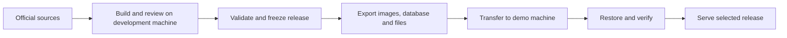

# Hackathon operations and demo guide

Last updated: 2026-09-06.

This guide collects the hackathon workflow, technology choices, deployment
analysis and data-transfer approach. It is a working operations reference;
proposed deployment files and commands below are not implemented features.

## 1. Scope and current state

TIP supplies authoritative evidence, citations, applicability and limitations
for structured knowledge requests. The calling assistant interprets the user's
question, discovers catalog identifiers, collects missing context and composes
the answer. The hackathon should demonstrate that boundary in a focused Swiss
residence scenario before expanding coverage.

| Area | Current state |
| --- | --- |
| Acquisition | Bounded crawler and source-catalog runner with saved HTML snapshots and provenance |
| Source coverage preparation | Residence source catalog with 59 official references across 26 cantons; references do not imply evaluated knowledge coverage |
| Semantic preparation | Concept proposal and model review CLIs, local/hosted profiles, checkpoints and experiment reports |
| Shared contracts | Versioned catalog, context, evidence and request contracts with offline validation |
| Human review | POC-01 reference concepts and draft comparisons exist; second review and quality evaluation remain pending |
| Published knowledge service | Catalog publication, immutable releases, scoped retrieval and MCP tools remain unimplemented |
| Deployment | No implemented Docker Compose stack or release export/import workflow |
| Admin UI | Planned React application and control API, with P1 priority |

The [implementation backlog](../TODO.md) owns detailed status and acceptance
gates. The [technical specification](architecture/technical-specification.md)
owns architecture and contracts. This guide does not replace either document.

## 2. Technology choices

| Concern | Technology | Operational guidance |
| --- | --- | --- |
| Backend and build tools | Python 3.11+ | Use the repository-local `.venv` for local Python commands; install dependencies separately inside container images |
| Structured client interface | MCP, with REST as a secondary interface | Planned adapters over shared runtime behavior |
| Durable operational data | PostgreSQL | Planned store for catalogs, evidence, facts, rules and releases |
| Vector retrieval | pgvector | Planned extension in the same PostgreSQL service |
| Lexical retrieval | PostgreSQL full-text search | Avoid another search service for the MVP |
| Raw snapshots | Filesystem initially | Architecture also permits MinIO; introduce it only when needed |
| Semantic preparation | Apertus through provider adapters | Existing local Ollama and hosted Hugging Face profiles |
| Embeddings | Separately configured multilingual embedding provider | Apertus is not implicitly the embedding model; runtime query vectors must match the release's embedding space |
| Admin UI | React, TypeScript, Vite and Mantine | Planned P1 capability |
| Control API | FastAPI and Pydantic | Planned P1 API with generated TypeScript client |
| Dedicated demo deployment | Docker Compose with Linux containers | Proposed packaging for repeatable setup on another machine |

Existing semantic profiles are `ollama_local`, `apertus_8b` and `apertus_70b`.
Selection is explicit and fails closed: a failed hosted request does not
automatically switch to Ollama. Hosted model access depends on credentials,
provider availability, account quota and connectivity. Local model speed and
GPU residency must be measured on the actual demo hardware.

See the [knowledge-builder guide](../apps/knowledge-builder/README.md) for
working installation, model configuration and CLI instructions.

## 3. Windows, WSL and Docker decision

| Setup | Benefits | Costs and appropriate use |
| --- | --- | --- |
| Native Windows | Fits existing PowerShell scripts and `.venv`; sufficient for today's CLIs | Native PostgreSQL/pgvector setup adds installation work as the stack grows |
| Windows application plus Docker services | Keeps the current development workflow; database setup becomes repeatable | Recommended incremental development setup once PostgreSQL is implemented |
| Full Docker Compose deployment | Packages application and service versions for another machine | Recommended target for a dedicated demo machine; requires packaging, data import and rehearsal |
| Application and services installed directly in WSL | Consistent Linux development environment | Useful when the team prefers Linux; migration alone adds little to the current CLI demo |

Docker and WSL are complementary. Docker Desktop can run Linux containers using
its WSL 2 backend while commands are issued from PowerShell. For Linux bind-mount
workloads, Docker recommends keeping source files in the Linux filesystem for
better performance. A packaged demo can use built images and named database
volumes to avoid depending on a live source checkout.
See [Docker's WSL documentation](https://docs.docker.com/desktop/features/wsl/)
and [filesystem guidance](https://docs.docker.com/desktop/features/wsl/best-practices/).

Ollama also runs natively on Windows with supported NVIDIA and AMD Radeon
hardware. Moving inference into a container requires verifying GPU support and
configuration on the destination machine; a container does not remove hardware
requirements. See [Ollama on Windows](https://docs.ollama.com/windows) and
[Ollama's Docker GPU guidance](https://docs.ollama.com/faq).

For PostgreSQL plus pgvector, a pinned container image avoids the documented
native Windows build route involving Visual Studio C++ tools and `nmake`.
See [pgvector installation](https://github.com/pgvector/pgvector#installation).

## 4. Build on one machine, demonstrate on another

Knowledge preparation and demo serving can happen on different machines. Build
and evaluate the knowledge once, then transfer one frozen release together with
the matching software. The demo runtime should read that release without
repeating crawling, candidate extraction or document embedding.



Docker images contain packaged software. Mounted volumes are separate data and
are not included when an image is copied. Volumes also do not automatically
synchronize between machines. See [Docker volume documentation](https://docs.docker.com/engine/storage/volumes/).

| Asset | Recommended transfer |
| --- | --- |
| Application and service images | Registry push/pull, or `docker image save` and `docker image load` for offline transfer; include every image needed at startup |
| PostgreSQL records and stored vectors | Custom-format `pg_dump` archive, restored with `pg_restore` into a fresh database with required extensions installed |
| Raw snapshots and generated evidence files | Archive of the exact files referenced by the release; preserve relative layout and verify hashes |
| Local model weights | Predownload on the demo machine or transfer the provider's model storage separately |
| Configuration | Compose file and non-secret settings, with credentials supplied separately at the destination |
| Release manifest | Matching application, schema, data, model, language-policy and ranking versions plus integrity hashes |

PostgreSQL dumps are portable across architectures. For this demo, pin the same
PostgreSQL major version and pgvector version on both machines to reduce
compatibility work. Provision database roles and credentials separately: a
single-database dump is not a complete server-account backup. A logical restore
rebuilds database indexes from their definitions; stored document vectors do not
need fresh model inference. Allow time for restore and index creation.
See [pg_dump documentation](https://www.postgresql.org/docs/17/app-pgdump.html).

Use a logical database dump instead of copying a running PostgreSQL data
directory. Freeze publication and relevant writes during export so database
references and exported files describe the same release. Preserve immutable
files until the bundle has been verified.

Transfer the completed bundle through a USB SSD, network share or artifact
storage. Keep the demo's running database in a local Docker volume; use shared
storage to transport completed exports. In particular, do not use the project's
OneDrive location as a live synchronized PostgreSQL data directory.

### Proposed bundle layout

```text
demo-bundle/
  compose.yaml
  images.tar
  knowledge.dump
  knowledge-files/
  release-manifest.json
  checksums.sha256
  config/
  .env.example
  README.md
```

This layout is a proposal, not an existing export format. `images.tar` is optional
when a registry is available. Large model archives can travel separately and
must be identified in the manifest. Do not include real credentials or a host
`.venv` in the bundle.

Use stable paths inside containers, such as `/data/snapshots`, with portable
relative object references. A release must not depend on a developer's absolute
Windows paths. Existing proposal reports may retain source paths as provenance;
do not silently rewrite historical reports. The future importer must distinguish
provenance from paths needed to locate runtime files.

Image builds must support the demo machine's CPU architecture. Verify GPU access
separately if local inference is part of the presentation. Offline delivery also
requires all model assets, caller dependencies and container images to be present
before arrival. See [Docker image export](https://docs.docker.com/reference/cli/docker/image/save/).

## 5. Hackathon workflow

1. **Select the scenario.** Choose a bounded official-source scenario, the
   expected questions, required context and citations. Assign a build operator,
   reviewer and demo operator; one person can hold several roles.
2. **Acquire inputs.** Inspect the source plan offline, then run a deliberately
   bounded crawl. Preserve exact snapshots and provenance. Use the
   [residence catalog guide](../config/catalogs/README.md).
3. **Prepare knowledge.** Run concept extraction with an explicitly selected
   model and request budget. Retain reports and checkpoints. Complete human
   review before promoting candidate output into published knowledge.
4. **Evaluate.** Apply the relevant backlog gates for evidence, applicability,
   multilingual behavior and retrieval. Record coverage limits. A successful
   extraction command alone does not establish a working knowledge service.
5. **Publish and freeze, once implemented.** Select an evaluated release and
   record its matching software and provider configuration. Keep the previous
   known-good release available.
6. **Export and transfer, once implemented.** Produce the database archive,
   matching files, manifest and image references. Verify bundle integrity.
7. **Import and rehearse.** Restore into fresh demo storage, run smoke checks and
   confirm the expected release identity before presenting.
8. **Present.** Show catalog discovery, required clarification, the structured
   request and supporting evidence as those capabilities become available.
   Label saved reports and recordings explicitly when demonstrating preparation
   results or using a fallback.

The [first-round pitch](pitch/first-round-10min.md) describes intended product
behavior. Match live claims to implemented and validated capabilities.

## 6. Demo startup, verification and recovery

The proposed Compose stack should start the database first, wait for readiness,
perform an explicit first-time import, and then start the runtime and UI if
implemented. Keep the knowledge builder as an operator-triggered job or optional
Compose profile. Ordinary startup must not recrawl sources, trigger paid
extraction, or overwrite an existing database.

Before the event:

- Pin and preload images, model assets and the selected data release.
- Restore the bundle on the actual demo machine and measure restore/startup time.
- Check the release ID, file hashes, representative evidence links and supported
  queries; verify citations resolve to the intended original source content.
- Confirm runtime model access and latency. Precomputed document embeddings do
  not remove query-embedding or configured ranking/caller model dependencies.
- Test after a reboot and without internet. Record which parts remain usable;
  hosted inference and live source access require connectivity.
- Prepare a clearly labelled saved-output or recording fallback and keep the
  previous verified bundle for recovery.

During the event, start the rehearsed stack and run a short smoke check before
the audience arrives. Avoid fresh image pulls, upgrades or full knowledge builds
in the presentation path. If hosted inference fails, switch only through a
previously tested configuration; the current extractor has no automatic fallback.
Future runtime fallbacks must satisfy the release's evaluation policy.

For recovery, restore the previous verified software-and-data combination into
separate storage and validate it before selecting it. Avoid deleting the only
copy of demo data when resetting containers or volumes.

## 7. Current transfer process and next implementation work

Today, transfer saved crawl directories with their provenance manifests,
proposal reports, review artifacts and non-secret model configuration. Optional
checkpoints help resume extraction but are not a published knowledge release.
Retain the matching repository revision and run the existing CLIs using the
destination's own environment. There is no database or runtime release to export
yet.

To make the proposed dedicated-machine workflow executable:

- Add application Dockerfiles and Compose services as the runtime is implemented,
  with pinned versions, health checks and persistent storage.
- Define the portable release bundle and its manifest against the existing
  release contracts.
- Add export/import commands with database/file consistency and hash validation.
- Make import explicit and safe to retry; reject incompatible versions and
  avoid overwriting an existing demo dataset by default.
- Add a documented startup/smoke-check workflow and verify it on a fresh machine.
- Record the selected hardware, CPU architecture, GPU/model requirements,
  expected disk/RAM use, connectivity needs and measured startup/query latency.

These are proposed operational deliverables. Track their implementation and
acceptance with the [backlog's clean-deployment work](../TODO.md#poc-12---clean-deployment-discovery-usability-and-caller-behavior).
