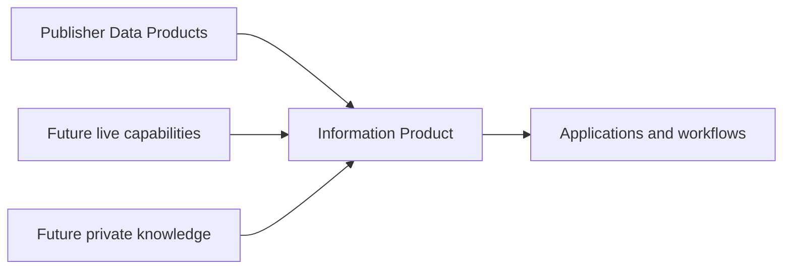
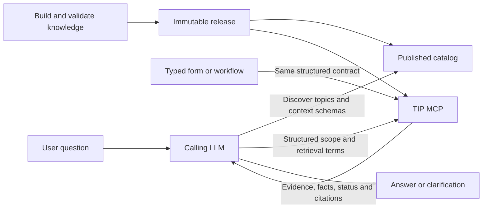
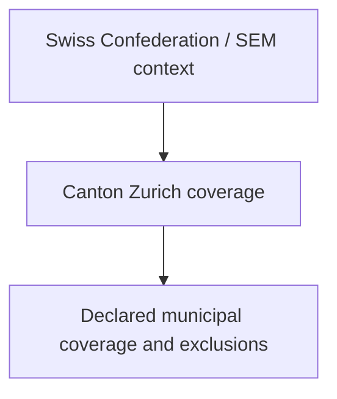
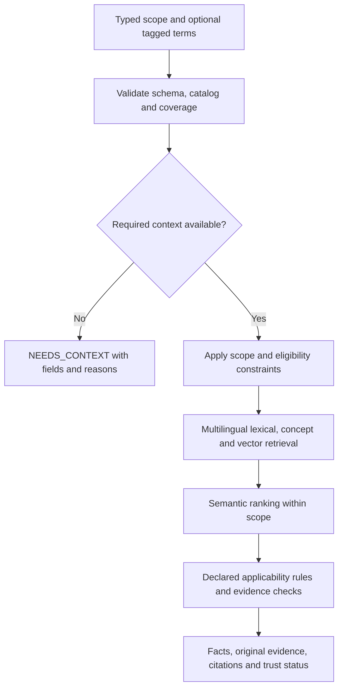
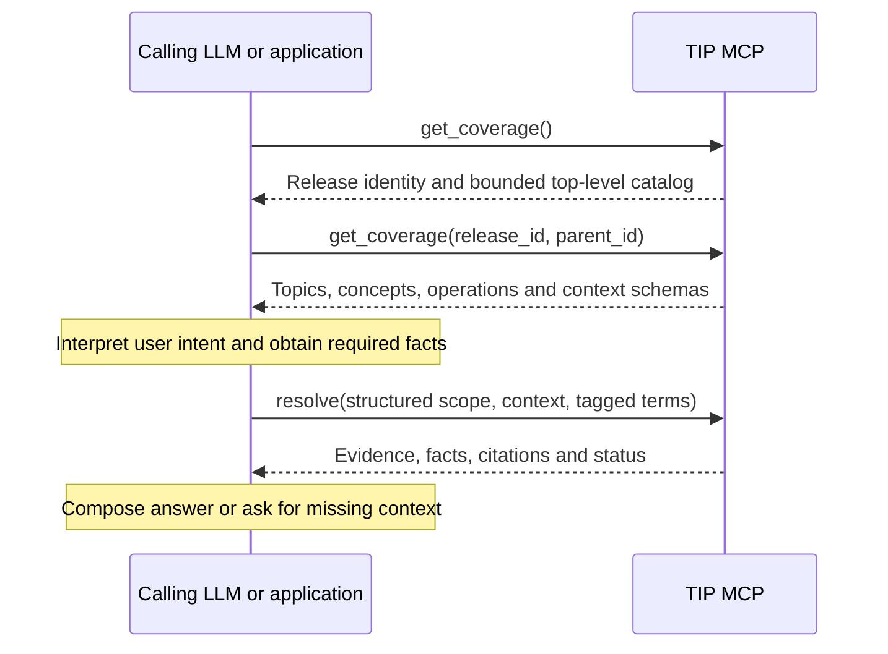
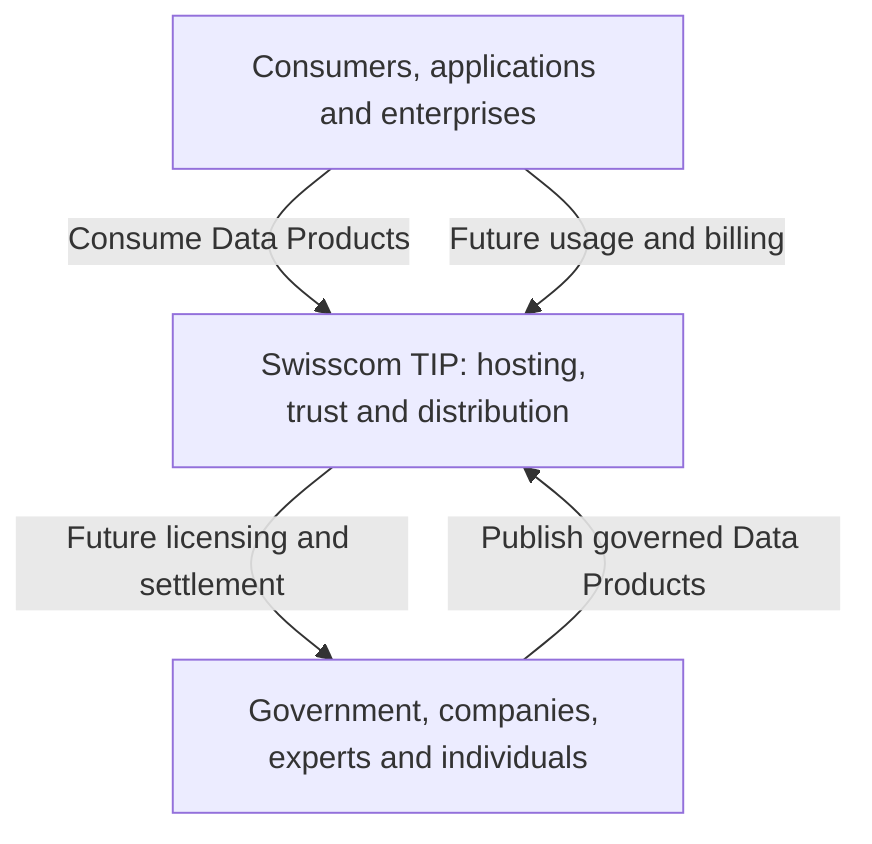
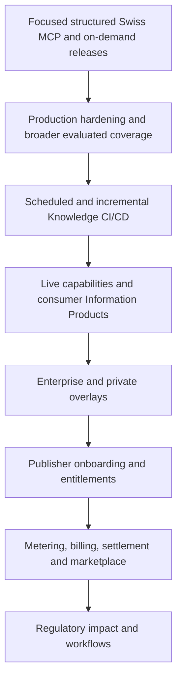

# Swisscom Trusted Information Platform
## Product & Functional Specification - V20

**Hackathon:** Swiss Grounding MCP using selected `admin.ch` / SEM and `zh.ch` sources<br>
**Primary deliverable:** Testable MCP server<br>
**Example MCP client:** OpenCode<br>
**Structured demo:** Swiss Arrival Checklist<br>
**Stretch demo:** Swiss Hike with clearly labelled mock data<br>
**Preferred semantic model:** Apertus, with a model-independent core<br>
**Technical design:** [`technical-specification.md`](../architecture/technical-specification.md)

---

# 1. Summary

> **Beyond search and retrieval: governed knowledge for AI.**

The Trusted Information Platform (TIP) publishes versioned, authoritative knowledge for AI clients and applications. Its MCP interface accepts explicitly scoped, structured requests identifying a Knowledge Space, domain, topic or concept, supported information intent, jurisdiction, applicability date and typed context.

The calling LLM interprets the user's question, discovers the catalog, selects identifiers, obtains missing facts and composes the final answer. A form or workflow can construct the same request directly. TIP validates supplied scope, retrieves and ranks eligible evidence, executes published rules where available, and returns compact evidence, verified facts, citations, freshness and explicit limitations.

> **Your assistant understands the question. TIP supplies the authoritative evidence for the scope it requests.**

Requests may preserve extracted retrieval terms in supported languages. Five-language metadata projections, reviewed terminology and multilingual semantic retrieval remain core capabilities within declared, evaluated coverage. The caller need not translate terms into one common language or into the source language. Similarity scores cannot establish intent, jurisdiction or applicability.

The hackathon delivers a focused Swiss-grounding MCP server built from selected `admin.ch` / SEM and `zh.ch` sources. It proves on-demand knowledge preparation, catalog discovery, structured grounding and traceable results. Private knowledge, live capabilities, automated Knowledge CI/CD and a publisher marketplace remain target-product extensions.

---

# 2. Product Vision and Strategic Hypothesis

**Decision class: Team product hypothesis**

TIP provides governed knowledge between authoritative publishers and the applications, workflows and AI agents that consume it.

## Product positioning

TIP is a governed knowledge service for AI clients and applications. Its product is the published knowledge catalog, evidence and structured contract that callers consume. Search and vector retrieval support this service; RAG applications can use its results as grounded context for generation.

| Capability | Role in the overall solution |
|---|---|
| Web search | Discover pages and potential sources |
| Vector storage and similarity retrieval | Index representations and find relevant candidate content |
| Retrieval-augmented generation (RAG) | Supply retrieved context to a model that composes an answer |
| TIP | Publish versioned knowledge with discoverable concepts, supported operations, explicit applicability, original-source citations, freshness and declared coverage limits |

The distinction is the knowledge product and its acceptance contract, rather than a particular retrieval algorithm or database. A relevant passage alone does not establish whether it applies to the requested jurisdiction, date and context. TIP validates that scope against published coverage and returns supported evidence or explicit missing-context, coverage and evidence limitations. These obligations define the service even when its retrieval components change.

Search systems and RAG applications can incorporate governance themselves. TIP makes these knowledge preparation, publication and evidence obligations a reusable service across callers. The calling application continues to own question interpretation and answer composition.

## Target users and value

| User or customer | Need | TIP value |
|---|---|---|
| AI assistants and application teams | Evidence for explicitly scoped information operations | Discoverable topics and concepts, multilingual retrieval, compact facts and citations without required client translation of supported terms |
| Enterprises and regulated teams | Governed external and internal knowledge | Versioning, provenance, applicability, auditability and future private overlays |
| Authorities and data publishers | Reusable machine-consumption channel | Maintained Data Products, declared coverage and distribution |
| Swisscom | Reusable trusted-information infrastructure | Hosting, integration, sovereign AI consumption and future commercial services |

## Target-product capabilities

1. **Trusted supply:** onboard authoritative sources, datasets and live capabilities.
2. **Knowledge lifecycle:** version, evaluate, refresh and publish governed releases.
3. **Discoverability:** publish identifiers, localized labels, scope combinations, supported operations and context schemas.
4. **Product composition:** combine Knowledge Spaces, Data Products and declared rules into typed Information Products.
5. **Multilingual grounding:** retrieve and rank original-source evidence using explicit scope and supported retrieval terms.
6. **Distribution and governance:** serve clients through MCP, REST and future SDKs with provenance, coverage, licensing and entitlements.
7. **Future economics:** support usage attribution, billing and publisher settlement where appropriate.

## Closed language catalog and release profiles

The versioned `tip-language-catalog/v3` catalog uses language-only identifiers for server-owned retrieval roles. It permits retrieval-term tags `en`, `de`, `fr`, `it`, `rm` and `gsw`. Source and metadata-projection roles permit the exact tags `en`, `de`, `fr`, `it` and `rm`. Term-language and source-declaration alias sets are empty. Jurisdiction is carried separately in structured scope, and regional terminology, dialect and idiom coverage in reviewed profiles. Raw website and detector tags retain their specificity in provenance; reviewed mappings may normalize them to enabled source languages.

| Role | Product meaning |
|---|---|
| Retrieval-term language | Caller-supplied language profile for an extracted term or short phrase used inside validated scope |
| Source language | Original language of authoritative evidence admitted by the registered source and release |
| Projection language | Standard language of compact derived retrieval metadata; metadata is a retrieval aid, not evidence |
| Catalog labels | Reviewed multilingual names, descriptions and aliases for discovery, using declared metadata languages |

An immutable release-specific `LanguagePolicy` enables an evaluated subset of the catalog and declares valid term/projection/source combinations for each covered space, topic, concept, intent, jurisdiction and temporal scope. Term-language aliases remain empty; every projection route and combination must refer to enabled roles. Publication fails for dangling references or missing required evaluations. The P0 target requires complete compact projections in all five standard languages for included P0 sections; no release may advertise that target as achieved before validation passes.

German (`de`) and Swiss German (`gsw`) term profiles route through reviewed terminology to the `de` projection. This routing does not prescribe the language of the caller's answer. Exact Swiss German dialect and Romansh idiom coverage is declared and evaluated, rather than inferred from a broad tag.

End-user question language, conversation handling and answer language belong to the caller. TIP has no whole-question language detector, mixed-span planner, fixed generated-response mapping or whole-question English fallback. Source-language detection during knowledge preparation remains part of the builder.

Term language never implicitly restricts source language. A German term can retrieve an eligible French original through evaluated metadata or embeddings. Neither model training coverage, provider metadata nor runtime configuration can add languages to the catalog or release. TIP exposes no standalone translation operation.

The business hypothesis is that Swisscom provides infrastructure and distribution while publishers remain responsible for canonical information. Managed hosting, service levels, enterprise overlays and derived Information Products can create value even when public information is free.

---

# 3. Hackathon Validation Outcome

**Published challenge requirement:** deliver an accessible, reproducible and testable Swiss-grounding MCP server.

**Team validation thesis:** a focused implementation can prove both immediate grounding quality and foundational capabilities of the larger TIP product, including catalog discovery and multilingual retrieval within a finite, release-gated profile.

The primary outcome is a GitHub repository that Swisscom can access, start and test with its evaluation harness and standards-compatible MCP clients.

| Validation level | Definition of success |
|---|---|
| Hackathon proof | A focused MCP server performs well on grounding, coverage, efficiency, operability and integration readiness |
| Product validation | The same implementation demonstrates reusable source, evidence, release, trust and distribution concepts that can evolve into the target product |

| Hackathon capability | Target-product hypothesis it validates |
|---|---|
| SEM and `zh.ch` source registry | Repeatable authority, publisher and source onboarding |
| Immutable snapshots and releases | Governed knowledge lifecycle and auditability |
| Evidence and Trust Envelope | Trusted, explainable Information Products |
| Closed release language profile and cross-language retrieval | Verified multilingual access without turning TIP into a general-purpose translator |
| MCP server | Reusable agent distribution channel |
| Arrival Checklist | Structured Information Product composition |
| Provider abstractions | Composition of external datasets and live capabilities |
| Refresh and evaluation | Future Knowledge CI/CD |
| Provenance and dependency records | Future governance, entitlement, usage attribution and settlement |

The solution must demonstrate:

- correct use of authoritative Swiss sources;
- jurisdiction-aware and temporally valid evidence;
- precise citation support;
- verified cross-language retrieval for the predefined language combinations enabled by the active release, with original-language evidence preserved;
- honest unsupported, insufficient and conflicting states;
- useful declared coverage;
- efficient tool selection and compact responses;
- reproducible setup, refresh and caching behaviour;
- resilience, monitoring, source etiquette and maintainability;
- a coherent, extensible MCP contract with discoverable identifiers and typed context requirements.

OpenCode is one supported example and test client. It is not a required or privileged integration, and the server must not rely on OpenCode-specific behaviour.

---

# 4. Product Model

## Knowledge Space

A compiled body of sources, snapshots, evidence, concepts, coverage, versions and tests. Examples include `swiss-public`, `emir-core` and `finma`.

## Data Product

A distributable publisher artifact containing knowledge, datasets or capabilities together with coverage, license, entitlement and commercial metadata. Examples include `Swiss Public Official`, `Swiss Hiking Routes Pro` and `SIX Market Data`.

## Information Product

An application capability combining typed inputs, Knowledge Spaces or Data Products, published rules and typed output. Examples include `swiss-arrival-checklist`, `swiss-hike-finder` and `emir-applicability`. Conversation and answer composition remain in the consuming application; optional AI may prepare knowledge or rank eligible evidence.



## Caller and MCP responsibilities

| Task | Calling LLM or application | TIP |
|---|---|---|
| Interpret the question | Identifies intent, terminology and needed context | Publishes supported operations and scope descriptions |
| Select scope | Discovers identifiers and disambiguates place names | Validates IDs, hierarchy, coverage and jurisdiction codes |
| Collect facts | Obtains user or form input without inventing missing values | Publishes typed schemas and reports missing fields |
| Retrieve evidence | Supplies scope and optional original-language terms | Uses multilingual projections, reviewed expansion and semantic ranking within that scope |
| Establish applicability | Supplies asserted context | Validates consistency and applies declared evidence-backed rules; does not certify user assertions |
| Explain or clarify | Asks follow-up questions and composes the answer | Returns facts, original evidence, citations, status and machine-readable limitations |



---

# 5. Core Principles

1. Stable authoritative information is prepared before request time; live information uses separately registered capabilities.
2. Publishers remain the canonical authorities.
3. The caller interprets user questions, selects scope, collects facts and composes answers.
4. The MCP publishes its vocabulary and context schemas so callers do not invent identifiers.
5. Deterministic validation and hard constraints govern scope, jurisdiction, date and declared rule execution.
6. Semantic retrieval and ranking improve relevance within those constraints and cannot override them.
7. Supported retrieval terms require no client translation into a common language or expansion into source-language synonyms.
8. Apertus is preferred where evaluated value is demonstrated; the core and embedding/ranking contracts remain provider-independent.
9. Concept extraction proposes structure; provenance, review and evaluation determine publication.
10. Broad topics support navigation; independently supported concepts organize grounded operations.
11. Runtime uses a compact set of high-quality evidence and returns structured results with a Trust Envelope.
12. The MCP does not generate user-facing answer prose or infer missing applicability facts from retrieval terms.
13. Original-language evidence remains authoritative. Full source pages are not machine-translated as the default retrieval representation.
14. Compact five-language metadata projections and reviewed term routes preserve source provenance. Translations are labelled derivative content.
15. Missing context, coverage gaps, insufficient evidence, conflicts and stale evidence remain explicit outcomes.
16. Scope is never silently widened to improve a semantic match.
17. MCP is the primary hackathon interface. REST and typed applications reuse the same grounding contract.
18. Publisher licensing, autonomous refresh and marketplace economics remain post-MVP.

---

# 6. Information Classes

| Class | Example | Functional strategy |
|---|---|---|
| AUTHORITATIVE | Residence rules | Compiled Knowledge Space |
| LIVE | Train fare or weather | Live Capability |
| PRIVATE | Lease or company policy | Private Knowledge Space |
| CONSENSUS | Recommended places | Recommendation data |
| DERIVED | Best hike tomorrow | Data, capabilities and constraints |
| HISTORICAL | Rule in 2024 | Versioned knowledge release |

---

# 7. Hackathon Scenario and Coverage

Primary end-user scenario, interpreted by the calling application:

> **I am an EU/EFTA national moving to Canton Zurich for a job. What do I need to do after arriving?**

The caller discovers relevant topics and supported operations, obtains additional required facts, and sends a typed request. TIP receives that structured scope rather than the question. Federal/cantonal relationships and local limitations are explicit coverage data.



The shorter question `How to get Aufenthaltsbewilligung in Zurich?` is also a caller example. The caller can retain `Aufenthaltsbewilligung` as a `de` retrieval term, but must disambiguate city versus canton when material and must not infer nationality, purpose or duration. Missing facts produce typed missing-field results that the caller turns into clarification.

The server demonstration tests discovery, authoritative evidence, scope/applicability checks, multilingual retrieval and efficient tool use. Its declared retrieval-term profiles include English, German variants, French, Italian, evaluated Swiss German forms and the declared Romansh idiom. These are term-retrieval profiles, not a promise that TIP understands complete user questions in those languages.

Coverage begins with selected `admin.ch` / SEM and `zh.ch` material. Sources, topics, concepts, intents, jurisdictions, required context, language combinations, temporal scope, exclusions and last refresh are exposed by the catalog. Complete Swiss, cantonal or municipal coverage is not implied.

---

# 8. Hackathon Scope and Priority

## P0 - Published challenge outcome

- working MCP server in an accessible GitHub repository;
- clear setup, client configuration, coverage and limitations documentation;
- useful, declared authoritative Swiss coverage;
- grounded retrieval and exact citation support;
- compact responses designed for efficient agent use;
- explicit unsupported, insufficient, conflicting and stale states;
- reproducible refresh, caching, resilience and monitoring behaviour;
- compatibility with the Swisscom harness and standard MCP clients;
- safe secret and test-access handling.

## P0 - Team MVP choices

- focused `admin.ch` / SEM and `zh.ch` coverage;
- operator-triggered, on-demand knowledge builds;
- traceable source versions and immutable published releases;
- a versioned product language catalog and immutable release profile for evaluated retrieval-term, source and projection roles;
- normalized evidence with source-language, authority, jurisdiction, applicability and temporal metadata;
- a reviewed seed concept graph and multilingual terminology for the principal scenario;
- hierarchical catalog discovery with stable IDs, supported intents, context schemas, valid combinations and release pinning;
- post-normalization candidate concept extraction and corpus-level aggregation;
- compact retrieval metadata projections for English (`en`), German (`de`), French (`fr`), Italian (`it`) and Romansh (`rm`);
- tested generic German and German (Germany) terminology plus Swiss German dialect aliases, normalized to Swiss Standard German retrieval terms;
- scoped language-aware lexical, canonical-concept and multilingual vector retrieval with semantic ranking/reranking;
- automated grounding, citation, multilingual retrieval, efficiency, freshness and integration tests;
- structured resolution calls, typed missing-field outcomes and compact Trust Envelopes.

Cross-language retrieval, five-language metadata projections and scoped semantic ranking are P0 capabilities for declared coverage. Curated terminology and canonical-concept lookup complement multilingual embeddings and reranking. Release evaluations measure relevance, recall, precision, latency and scope compliance. Apertus is the preferred semantic provider; vector retrieval uses a separately evaluated multilingual embedding provider. Either provider may be replaced without changing the functional contracts. User-question interpretation, clarification and answer rendering belong to the caller.

## P1 - Product-validation extensions

- Admin Control Plane for sources, builds, evidence, tests and releases;
- REST access to the same published release;
- Swiss Arrival Checklist using typed inputs and outputs.

## P2 - Product-composition stretch

- Flutter Swiss Hike client;
- 10-20 clearly labelled `DEMO/MOCK` routes;
- mock transport, weather and places providers;
- deterministic filters and optional preference ranking.

## Target-product capabilities not implemented during the hackathon

```text
scheduler / periodic watcher
incremental build and promotion
autonomous Knowledge CI/CD
publisher self-service onboarding
marketplace discovery UI
pricing / billing / metering / settlement
publisher payouts
production entitlement engine
real SBB / weather / places integrations
```

These capabilities remain part of the target-product vision and influence current contracts and architectural boundaries. Their implementation is excluded from the hackathon vertical slice. The absence of a scheduler does not remove the requirement for an observable on-demand refresh, cache policy, freshness metadata and stale-result handling.

---

# 9. Knowledge Build Behaviour

An operator can initiate **Build / Full Reload** for the configured sources.

The product must:

1. show which sources are included;
2. discover website language variants within the configured crawl scope, acquire eligible variants and preserve source versions;
3. normalize relevant source content;
4. detect and record the language of each normalized document and evidence object;
5. extract candidate concepts and document-to-concept assignments from normalized sections;
6. aggregate candidates across documents, sources and languages;
7. merge synonyms and translations, create broader/narrower/related relationships, and apply the configured granularity policy;
8. promote only reviewed or automatically verified concepts into the published concept graph;
9. derive evidence and optional candidate facts while preserving original-language text;
10. build compact localized retrieval metadata from official parallel content or labelled machine translation;
11. build language-aware lexical, canonical-concept and multilingual vector representations;
12. evaluate the candidate release against its declared concept and cross-language matrices;
13. publish it only if the evaluation gate passes;
14. preserve the last successful release if a build fails;
15. expose build progress, failures and freshness;
16. publish the immutable catalog, context schemas, supported intents, rule versions and valid coverage combinations with the release.

Each build must bind a versioned content policy to its declared coverage and operations. Normalization and extraction must preserve substantive authority contact information and procedures when those facts are included in that scope. Generic navigation, feedback controls and other page furniture may be removed, but a contact, footer or inherited heading alone cannot justify excluding substantive included facts. Record exclusions and incomplete processing with their reasons.

Coverage evaluation must use the scope and content policy fixed before inspecting results. Distinguish source exclusions and skipped processing from concepts never proposed, rejected proposals, claims represented elsewhere, partial representations and claims missing from the retained set. Search the fixed proposal set for other representations before declaring a concept missing; shared labels or source sections alone do not establish coverage. A later scope revision requires a new version and cannot retroactively remove observed gaps to improve an earlier result.

Normal MCP requests use the published release and do not scrape government sites at request time.

### Website language discovery

Website language discovery is a P0 acquisition requirement. Given a configured website root such as `https://admin.ch/`, the builder must inspect the root and subsequently fetched pages for language selectors and alternate-language links, inspect permitted sitemaps, and add discovered eligible language entry URLs to the crawl. An operator must not need to supply a separate seed URL for every language exposed through supported discovery mechanisms. A redirect to one default language must not restrict discovery to that language.

The builder must:

- discover variants from HTML and HTTP `hreflang` links, language-selector links or URL-valued options in returned HTML, and sitemap alternate-language entries; record page-language declarations and redirect observations as supporting hints;
- retain the discovered URL, advertised language and discovery provenance, and distinguish advertised languages from languages verified in fetched content;
- crawl discovered variants admitted by the configured URL scope, source-language declarations and candidate release policy, subject to robots rules, rate limits and shared crawl budgets; discovered subdomains require explicit scope permission;
- preserve language-specific URLs, including meaningful query parameters, and treat alternate-language links as candidate relationships until content and version validation establishes an eligible parallel version;
- report discovered, fetched, validated, excluded, failed and unresolved variants with reasons, plus incomplete discovery caused by crawl limits or inaccessible mechanisms; absence of discovered alternatives must not be reported as proof that a site is monolingual;
- use a configured source adapter for selectors that require JavaScript or cookies when available; otherwise report an observed unresolved selector as requiring an adapter and allow explicit language entry URLs. Automatic browser interaction is not required for P0, and discovery coverage must state this limitation.

Discovery does not add languages to the product catalog, source declaration or release policy. Website labels such as `de` or `fr` are untrusted discovery hints, not valid source declarations or proof of a regional language profile. Admission and content-language validation follow the existing governed language rules. An advertised language alone does not establish published coverage.

For the root-scan acceptance scenario, a fixture representing a multilingual government website redirects to a default-language page whose selector exposes German, French and Italian URLs. With those source languages and paths enabled and sufficient crawl budget, all three variants must be discovered and fetched without separate language seeds. The report must identify any excluded or unreachable variant. A missing required variant blocks publication; optional gaps are reported and excluded from claimed coverage. This fixture defines behavior without assuming the current structure or complete coverage of the live `admin.ch` website.

## 9.1 Concept Compilation and Granularity

Concept extraction occurs during the knowledge build after crawling, snapshotting, normalization and language detection. It is not part of source acquisition. This separation allows extraction to be retried, evaluated or rerun with another provider without fetching the source again.

The published representation is a language-neutral, versioned concept graph rather than a flat keyword list or a strict single-parent tree. A document or evidence object may be assigned to several concepts, and concepts may have `BROADER`, `NARROWER`, `RELATED` and `SAME_AS` relationships.

The granularity model is:

| Level | Purpose | Examples |
|---|---|---|
| Domain | Top-level coverage and navigation | Immigration, Health, Housing |
| Topic or journey | Catalog discovery and explicit request scope | Residence, Healthcare access |
| Answerable concept | Independent action, obligation or question with its own evidence | Residence permit, Municipal registration, Health insurance |
| Detail | A subtype, deadline, exemption or other precise fact | Permit B, Registration deadline, Insurance exemption |

`ANSWERABLE` is the default grounding level. Domains and topics organize coverage and discovery. Descendant expansion requires an explicit scope mode; a broad label alone cannot support a factual conclusion.

A candidate becomes a separate answerable concept when one or more of the following differs: required user action, responsible authority, applicability, deadline, legal effect, required documents, authoritative source or independently meaningful user question. Translations, synonyms, abbreviations, spelling variants and dialect variants of the same administrative or legal object are merged as terminology for one concept. For the Swiss residence-permit concept, for example, `Aufenthaltsbewilligung` is the preferred `de` term and `Aufenthaltserlaubnis` can be a reviewed `de` retrieval alias with German regional terminology provenance within that declared concept scope. A foreign permit supplied as typed context remains a distinct entity; terminology expansion cannot reinterpret that fact or establish Swiss intent.

For example, `Residence` is a broad topic. `Residence permit`, `Municipal registration`, `Change of address` and `Deregistration` are separate answerable concepts. Municipal conduct rules may be related to living in a municipality but are not automatically children of `Residence permit`. Likewise, `Health` is a domain while `Health insurance`, `Healthcare access`, `Emergency care` and `Public health` are separate concepts.

Concept governance states are:

```text
CURATED             producer/admin defined and accepted through recorded semantic review
VERIFIED_AUTOMATIC  extracted automatically and accepted by evaluated semantic validation
CANDIDATE           unverified; usable only as a soft retrieval signal
MERGED              redirected to another stable concept identifier
DEPRECATED          retained for compatibility and audit history
REJECTED            excluded with recorded rationale
```

The Knowledge Space producer owns the seed graph, granularity policy and P0 concepts. An administrator or delegated reviewer approves changes to curated concepts. Apertus may propose candidate concepts, terminology, translations, assignments and relationships, but model output does not automatically become declared coverage. During the hackathon, reviewed concepts may be maintained as repository configuration; authoring and review through the Admin Control Plane is a P1 capability. In the target product, publishers own their domain concept packs subject to platform validation and governance.

Every concept and assignment records provenance, evidence references, extraction method, confidence, lifecycle status and version. Concept identifiers remain stable when labels change, and published Knowledge Releases reference the exact concept graph used for indexing and evaluation.

Semantic acceptance applies to each claimed operation and scope:

1. The claim must preserve every material population, condition and exception needed for that operation, including logical alternatives and conjunctions, strict or inclusive boundaries, quantities, units, duration windows and deadline starting events. Preserve distinctions between legal effects, such as permission, quota status, registration and document issuance. An overview must retain the associations needed for every item it claims to cover; a focused procedure step need not claim the entire procedure.
2. Evidence must support the logical claim and its qualifications, even when they span normalized sections or resume after an embedded heading or information box. A primary heading cannot replace explicit body scope or justify losing conditions. Such evidence must retain governed source references and provenance; uncited context cannot silently repair a saved claim. Missing normalized content remains an explicit evidence limitation until a reviewed correction is recorded.
3. Record claim support, scope alignment and completeness separately. Assess each candidate example question against the saved candidate and its cited evidence within the stated scope. A full citation does not make an incomplete structured claim complete, and a supported claim does not make every related question answerable. Preserve the original question when narrowing it or marking it unsupported, together with the revised scope, reason, author and review status. These questions are build-review aids and do not become MCP question inputs.
4. Source ambiguity must remain explicit. Do not invent a threshold, combine uncertain conditions into an eligibility rule or fill an unspecified deadline trigger. Record unresolved source interpretation separately from missing user context and from model errors; collecting an already-known user fact cannot resolve a gap in the source rule.
5. Promotion to `CURATED` or `VERIFIED_AUTOMATIC` requires recorded acceptance of the applicable material dimensions. Exact citation offsets, structural validity, confidence or approval by the extraction model alone are insufficient. A failed material dimension blocks the affected claim or operation; reviewed excerpts or narrower claims with their own recorded acceptance may remain available with their limitations, without publishing an unsupported structured conclusion. Corrections require a reviewed revision and do not count as support already present in the original candidate.

## 9.2 Localized Retrieval Metadata

TIP preserves each normalized section in its original language and does not machine-translate complete source pages as the default retrieval representation. Instead, each included section receives a compact localized projection containing:

```text
title
section headings
keyphrases and terminology
short retrieval synopsis
canonical concept identifiers
named entities and jurisdiction references
```

The default projection languages are English (`en`), German (`de`), French (`fr`), Italian (`it`) and Romansh (`rm`). The Romansh coverage declaration identifies whether `rm` means Rumantsch Grischun and which additional idioms, if any, are evaluated.

For each field whose target language equals its source language, TIP uses the unchanged normalized original and records `ORIGINAL_SAME_LANGUAGE`. For another target language, it prefers an eligible official parallel-language version published by the same authority, then curated terminology, then a machine-generated translation. Every projected field records its method, provider/model where applicable, review status and original content hash. Canonical concept identifiers, authorities, jurisdictions, dates and other structured values are not translated.

German (`de`) and Swiss German (`gsw`) are retrieval-term profiles. They use reviewed terminology or dialect aliases and route to the `de` projection without separate regional metadata variants. TIP preserves each supplied term tag. The caller controls answer language; routing does not generate or prescribe a response. Coverage lists accepted term tags and evaluated dialect forms.

Localized projections are candidate-retrieval aids, not evidence. Results and citations always resolve to the original source section or an official parallel-language source section.

---

# 10. Structured Resolution Behaviour

TIP establishes scope from schema-validated selectors and asserted context. It must:

1. validate schema/release references, required fields, identifiers and hierarchy consistency;
2. locate the published coverage profile and its supported intent/context schema;
3. report missing conditional applicability fields without inferring their values;
4. constrain eligible evidence by explicit topic/concepts, jurisdiction, date, supplied facts and source-language restrictions;
5. route optional tagged retrieval terms, expand reviewed terminology and retrieve lexical/concept/vector candidates within that scope;
6. rank eligible evidence, apply published rules where available and preserve source qualifications;
7. return available verified facts or rule outputs, compact original-language evidence, citations and a Trust Envelope.

The server does not accept a user question as its resolution contract, classify user intent, infer place names from prose or generate the final answer. Text inside `retrieval_terms` is a bounded relevance signal, even if it resembles a sentence. It cannot repair missing scope/context or override structured values.



## 10.1 Multilingual Retrieval Behaviour

The request can contain terms in several languages, each explicitly tagged. No whole-question language detection, carrier language or mixed-span classification is required. The release publishes supported term profiles and term-to-projection routes.

For each supplied term, TIP canonicalizes BCP 47 casing, validates the exact enabled language-only tag, routes it to the declared metadata projection and preserves the original term. Reviewed terminology expansion and multilingual embeddings improve recall inside the explicit scope. `de` and `gsw` route to `de` metadata using evaluated terminology or dialect aliases. This has no effect on the language chosen by the caller for its answer.

The compact projection languages remain `en`, `de`, `fr`, `it` and `rm`. An English term can match an English projection of a German original. A German term can retrieve a French original through an evaluated route. The caller does not translate supported terms into a common language or know the source languages.

`source_languages` is independent of term language. Omission or `null` means no evidence-language restriction; an explicit non-empty list is canonicalized and deduplicated. An empty list or malformed tag is `INVALID_ARGUMENT`. Unsupported term/source tags produce `UNSUPPORTED_LANGUAGE` with the affected field and supported profiles. Individually enabled profiles whose requested combination is not covered produce `OUT_OF_COVERAGE`. No unsupported term or explicit filter is silently dropped.

Projection text and machine translations remain derivative retrieval metadata. Citations always identify original-language evidence or an eligible official parallel-language source, with provenance.

## 10.2 Explicit Topic and Concept Scope

`domain` names the main knowledge area, `topic` the broader theme, and `concept` an independently supported unit. Callers discover this hierarchy before selecting identifiers.

A supported topic-level operation may omit `concept_ids` and use retrieval terms to rank evidence already assigned to that topic. A missing operation-required concept selector produces `INVALID_ARGUMENT` with the affected field; the server does not guess it from prose. `NEEDS_CONTEXT` applies to missing conditional applicability facts inside an otherwise valid context envelope.

`scope_mode=exact` uses only the selected scope and its published direct evidence assignments. `scope_mode=descendants` permits bounded traversal through declared narrower concepts, with results grouped by concept. Related or sibling topics are not automatically included. Published applicability rules may admit federal evidence for a cantonal scope while retaining its actual authority and jurisdiction.

Unknown identifiers, inconsistent domain/topic/concept relationships and undeclared fields are validation errors. Missing concept assignments remain build/coverage quality issues. Lexical/vector recall paths may recover evidence with verified assignments inside the requested scope, but cannot escape that scope.

## 10.3 Result Guarantees and Retrieval Reliability

Every returned fact or rule output references supporting evidence and applicable rule versions. Exact citation offsets alone do not establish semantic completeness. If only excerpts are verified, TIP returns those excerpts without inventing a structured conclusion.

`SUPPORTED` applies to the executed information operation under supplied context. It does not certify the caller's interpretation, the truth of user assertions or the final client answer. The result echoes requested/executed scope and limitations so the client can inspect the boundary.

Hard scope constraints and published rule execution are deterministic. Semantic scores or order may vary with model-based ranking; record release, projections, index, model and ranking configuration. Exact replay is guaranteed only for deterministic or recorded ranking paths. Cross-language evaluations measure relevant evidence and scope compliance rather than requiring identical ordering.

Provider failure uses only a declared lexical/concept fallback that preserves constraints and reports retrieval degradation; otherwise return a typed retrieval error. Build failures preserve the last successfully published release.

---

# 11. Result Statuses

| Status | Meaning |
|---|---|
| `SUPPORTED` | The structured operation is supported within its returned scope and limitations |
| `PARTIALLY_SUPPORTED` | Supported and unresolved parts of the requested operation are explicitly separated |
| `NEEDS_CONTEXT` | A valid scoped request lacks conditional applicability facts; returns field paths, reasons and allowed values |
| `OUT_OF_COVERAGE` | Recognized selectors form an unsupported combination, date falls outside coverage, or an explicit source filter leaves no covered sources |
| `INSUFFICIENT_VERIFIED_EVIDENCE` | A covered operation lacks sufficient verified evidence for this request |
| `CONFLICTING_EVIDENCE` | Applicable sources conflict and no published rule resolves the conflict |
| `STALE` | Available evidence fails the declared freshness policy |
| `UNSUPPORTED_LANGUAGE` | An explicit retrieval-term or source-language tag is unsupported; the affected field and supported profiles are returned |

`INVALID_ARGUMENT` is a boundary error for malformed or missing required envelope fields, wrong types, unknown IDs, inconsistent selectors and undeclared fields. Conditional applicability facts may be absent from an otherwise valid `context` object; that is `NEEDS_CONTEXT`, not a fabricated default. `RELEASE_UNAVAILABLE` is a typed tool error when a well-formed requested release reference cannot be served. The server never silently substitutes the active release.

For an otherwise valid, covered request with adequate user context, unresolved source interpretation is an evidence limitation. Where verified evidence is insufficient, return `INSUFFICIENT_VERIFIED_EVIDENCE`, or `PARTIALLY_SUPPORTED` with the supported and unresolved parts separated; preserve explicit conflict and freshness outcomes where applicable. Do not substitute a repeated context request for that evidence limitation. Missing or excluded content does not establish that no obligation exists, and a covered topic does not establish a complete procedure or overview.

Every resolution result carries requested/executed scope, schema/release identity, evidence/citations, authority/jurisdiction, applicability conditions, freshness and any missing context, conflict or limitation. Retrieval degradation is reported separately from factual status. A relevance score never establishes applicability, factual support or legal correctness.

---

# 12. MCP Capability and Catalog Discovery

The primary tools are:

1. `swiss_information.get_coverage`: discover the published knowledge catalog, coverage, context schemas and freshness.
2. `swiss_information.resolve`: execute a structured information request against a pinned release.
3. `swiss_information.get_evidence`: inspect cited original evidence and provenance within its release.

## 12.1 How Callers Discover Topics and Concepts

The MCP tool description directs callers to `get_coverage` before constructing unfamiliar requests. The initial bounded response lists Knowledge Spaces and top-level domains. A caller then inspects the relevant parent to obtain topics and concepts. Tool field schemas explain the request shape; the release catalog provides dynamic allowed values and combinations.

Discovery accepts optional `release_id`, `knowledge_space_id`, `parent_id`, `cursor` and `limit`. Omitted release selects the active release for initial discovery and returns its immutable identity; all continuation and child calls must use that identity. Pagination is stable within that release. A cursor cannot be reused against another release or filter scope.

Catalog entries include:

- stable identifiers, type, parent/broader relationships and localized labels, aliases and descriptions;
- supported information intents, such as `requirements` or `procedure`, when evaluated for that scope;
- jurisdiction codes, temporal coverage, federal/cantonal applicability and municipal exclusions;
- inline typed context schemas in topic/concept details, with stable schema identifiers, conditional required fields and allowed values;
- valid scope/operation/language combinations, evidence/rule availability and limitations;
- supported retrieval-term profiles, five-language metadata routes, source languages, provenance and freshness.

Clients can cache the catalog by release identity. They need not load the whole graph or choose the finest-grained concept where a topic-level operation is supported. They must not invent IDs or treat the existence of a topic as coverage of every possible operation.



## 12.2 Structured Request

The `structured-grounding/v1` envelope includes required `schema_version`, `release_id`, `knowledge_space_id`, `domain_id`, `topic_id`, `intent`, `jurisdiction`, `context`, `as_of` and `scope_mode`. `concept_ids` is optional unless the operation requires it. Optional `retrieval_terms` entries contain bounded `text` and a required supported `language` tag. Optional `source_languages` constrains original evidence; `max_evidence` is a positive count capped by published server limits.

There is no `question`, conversational history, whole-question `query_language`, generated-answer `response_language` or arbitrary prose context field. Domain/topic/intent/jurisdiction/context must be schema-valid even when terms are supplied.

Illustrative identifiers below are contract examples, not claims of current published coverage. After clarifying Canton Zurich and the requested applicability date, the caller could preserve the original German term:

```json
{
  "schema_version": "structured-grounding/v1",
  "release_id": "example-release-001",
  "knowledge_space_id": "swiss-public",
  "domain_id": "immigration",
  "topic_id": "residence",
  "concept_ids": ["residence-permit"],
  "intent": "requirements",
  "jurisdiction": {"country_code": "CH", "canton_code": "CH-ZH"},
  "context": {},
  "as_of": "2026-09-06",
  "scope_mode": "exact",
  "retrieval_terms": [
    {"text": "Aufenthaltsbewilligung", "language": "de"}
  ],
  "max_evidence": 5
}
```

If that operation requires nationality group or purpose, `context: {}` produces `NEEDS_CONTEXT` identifying those field paths and reasons. The caller asks the user and resubmits. Those illustrative requirements are determined by the published schema, not asserted here as legal requirements.

One high-level resolution call is the normal target after the caller knows the catalog and has required facts. Discovery, pagination, clarification, evidence inspection and retries are counted separately in end-to-end efficiency reporting.

Exact schemas, output fields, transport and client setup are defined in the technical specification. This version replaces the previous required-question input contract; it describes intended behavior, not implementation verification. Harness input expectations must be checked during integration. Any conversational harness adapter belongs outside the MCP core.

---

# 13. Admin Control Plane

The P1 Admin UI makes platform state inspectable through:

1. Dashboard
2. Knowledge Spaces
3. Source Registry
4. Full-build initiation and progress
5. Source snapshots and freshness
6. Evidence Explorer
7. Concept Registry, candidate review and graph changes
8. Catalog IDs, supported operations, context schemas, active `LanguagePolicy` and term/projection/source coverage
9. Localized metadata projections and language coverage
10. Evaluations
11. Knowledge Releases
12. MCP/REST integration guidance

Its primary operation is **Build / Full Reload**. The Admin UI is not required for MCP runtime availability.

---

# 14. Swiss Arrival Checklist

The P1 structured application collects nationality group, purpose, duration, canton/municipality, arrival date and work-start date as required by its published operation schemas. It discovers the catalog and submits the same typed scope/context contract through MCP or the P1 REST adapter.

The backend returns supported requirements, deadlines, evidence identifiers, citations and a Trust Envelope. Missing municipality coverage is an explicit limitation. A form cannot imply a local requirement or invent an unspecified user fact.

The client owns interface language, explanation and any derivative presentation. The hackathon form chrome may remain English-only. The backend neither accepts a chat prompt nor requires a special queryless exception; structured requests are the general interface.

---

# 15. Swiss Hike Stretch Demo

The P2 Swiss Hike client demonstrates that the same platform can support a different typed Information Product.

Inputs may include origin, date, duration, difficulty, travel limit, scenery, weather and restaurant preferences. Outputs are typed route cards produced from clearly labelled mock routes and provider abstractions.

The demo illustrates composition and deterministic filtering; it does not claim production hiking, transport, weather or places coverage.

---

# 16. Target Product Capability: Knowledge CI/CD

**Decision class: Target-product capability; not implemented during the hackathon**

The full product may add scheduled source watching, cheap change detection, semantic impact analysis, incremental rebuilds, regression tests, and automatic or approval-based release promotion.

This is a strategic extension of the repeatable on-demand build proven during the hackathon, not a two-day deliverable.

---

# 17. Target Product Capability: Publisher and Data Product Marketplace

**Decision class: Target-product capability; not implemented during the hackathon**

TIP may evolve into a multi-sided platform:



Future publishers could create Data Products, connect sources, declare coverage and maintenance policy, configure licensing, publish versions and inspect usage or revenue. Public publication may require Swisscom review or certification.

Possible commercial relationships include usage/revenue share, recurring licenses, one-time licenses, publisher SaaS, and free/open public Data Products.

Before consuming a restricted Data Product, TIP would verify entitlement by tenant, application, purpose, geography, redistribution, retention, volume and contract period. Commercial executions could later create usage records for billing, cost attribution and publisher settlement.

Potential trust levels are:

```text
COMMUNITY
VERIFIED
EXPERT_VERIFIED
OFFICIAL
```

Trust level is independent of price.

---

# 18. Swisscom Alignment and Economics

**Decision class: Team product and business hypothesis**

TIP can strengthen myAI, eGovernment services, the Swiss AI Platform, Apertus-based services, banking services and enterprise AI.

Potential value includes API/MCP consumption, SaaS, hosting, managed knowledge, enterprise deployments, regulatory intelligence, inference consumption and future marketplace margin.

Publishers gain a machine-consumption distribution channel without having to build their own AI platform. Free public information can still support paid hosting, service levels, inference and derived Information Products.

---

# 19. Enterprise Reuse

**Decision class: Target-product reuse hypothesis**

For a UBS or Swiss Re context, public Swiss sources can be replaced or augmented by regulatory sources such as EMIR, ESMA, FINMA and DORA, together with governed internal policies and transaction or product context.

The reusable functional concepts are authority, jurisdiction, applicability, evidence, version, freshness, trust and explicit uncertainty. Any enterprise use would require separate governance, security, legal and production-readiness decisions.

---

# 20. Functional Definition of Done

Swisscom can:

- clone and start the repository, understand declared limitations and connect a standard MCP client;
- run on-demand builds of configured `admin.ch` / SEM and `zh.ch` sources;
- start a root-seeded website scan, discover eligible language variants and inspect provenance, exclusions, incomplete discovery and source validation;
- observe source versions, freshness, build outcome and preservation of the last successful release;
- discover the catalog hierarchically with pagination, cache it by release and obtain valid IDs, supported operations and conditional context schemas;
- inspect concept provenance/lifecycle and complete, provenance-linked P0 metadata projections in all five standard languages;
- inspect the closed catalog and evaluated retrieval-term/projection/source combinations;
- submit typed scope and terms in supported languages without translating to a common or source language;
- retrieve and rank eligible original-language evidence across each evaluated combination, preserving citations;
- obtain machine-readable missing fields without inferred nationality, purpose, place or date;
- receive explicit invalid-argument, unavailable-release, unsupported-language, coverage, insufficient-evidence, partial, conflicting and stale outcomes;
- verify exact scope, bounded requested descendant traversal, source-filter preservation and published applicability rules;
- inspect requested/executed scope and versioned retrieval/ranking provenance, with explicit provider degradation or a typed error;
- reproduce discovery, structured contract, multilingual recall/ranking, grounding, semantic-completeness, citation, freshness and integration evaluations.

Semantic acceptance must run a finite, versioned regression set with frozen source references, scope, proposal inputs and acceptance criteria. Include correct controls and cases covering missing conditions or exceptions, changed populations or logical operators, altered quantities or time boundaries, confused legal effects, conditions split across sections, substantive contact information excluded as page furniture, and questions broader than their cited evidence. Every known critical mutation in that set must be caught, and no unresolved material error may enter its accepted subset. Report raw counts and denominators, including omissions and false rejection of valid proposals; rejecting every candidate does not satisfy acceptance.

Record primary review, assistant drafting, model checks, same-person re-review and independent adjudication separately, including actual human review time. Assistant checks and a second pass by the same person do not establish independent agreement. Previously inspected development examples remain development evidence; claims about performance on unseen examples require a separately identified unseen reference set. Passing this finite regression set establishes only its tested scope and does not by itself establish independent review, generalization or complete product coverage.

Semantic scores cannot relax hard constraints. Repeated or cross-language requests need not have identical ranking from nondeterministic models, but must remain within scope and meet evaluated relevance criteria. Time-dependent freshness is evaluated at an explicit recorded time.

Client interpretation is evaluated separately: selecting catalog entries from English, German or mixed-language questions, obtaining facts, preparing equivalent structured scope and composing faithful cited answers. Those tests do not make the MCP a question interpreter.

OpenCode remains one example client. Apertus is preferred where evaluated value is demonstrated; compatible alternatives can be configured. P1 additionally provides Admin Control Plane, REST and Arrival Checklist. The mock Swiss Hike demonstration remains P2. Integration must verify the external harness's input expectations; a question-to-request adapter, if needed, remains outside the MCP server.

---

# 21. Product Evolution Roadmap



---

# 22. Final Positioning

> **Beyond search and retrieval: governed knowledge for AI.**<br>
> **Your assistant understands the question. TIP supplies the authoritative evidence for the scope it requests.**<br>
> **Five-language metadata and scoped semantic retrieval preserve multilingual access without required client translation.**<br>
> **Apertus supports knowledge preparation and scoped ranking; the platform remains model-independent.**<br>
> **Swisscom provides infrastructure, trust, distribution and commercial reach.**

The hackathon validates a discoverable structured MCP contract, published evidence and traceable scope checks. The caller owns interpretation, clarification and answer composition. Automated Knowledge CI/CD, enterprise overlays and the publisher marketplace extend the same evidence and governance foundation after the focused delivery.
