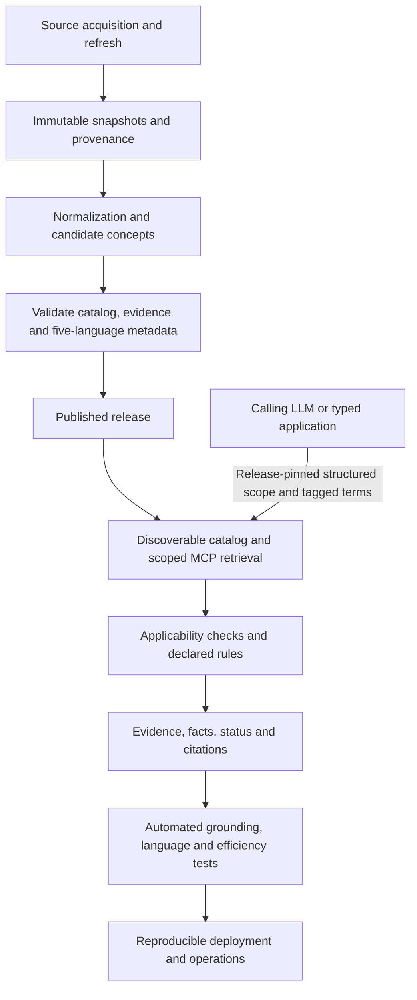
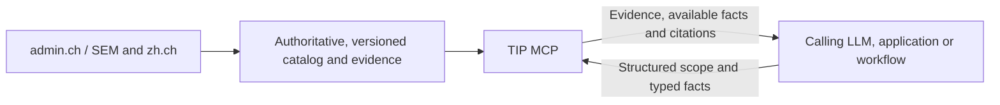
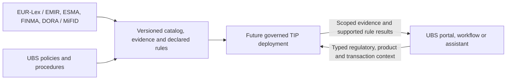

# Why We Should Choose the Swisscom TIP Challenge
## Challenge-selection rationale for the UBS hackathon team

**Published challenge descriptions used for this comparison:**

- [Swiss Grounding MCP](https://zh.ai-weeks.ch/challenges/swiss-grounding-mcp)
- [UBS Transaction Activity Forecasting](https://zh.ai-weeks.ch/challenges/transaction-activity-forecasting)

I think the Swisscom **Swiss Grounding MCP** challenge, addressed through our Trusted Information Platform (TIP), is the stronger choice for our team if our priorities are **technology scouting, broad engineering experience, reusable architecture and external visibility**.

The working MCP server is the hackathon vertical slice; TIP is the target-product vision that the slice is intended to validate.

The calling LLM interprets the user's question, discovers available knowledge in TIP's published catalog, selects identifiers and obtains missing facts. TIP accepts that structured scope and returns authoritative evidence, available verified facts, declared rule results, citations and limitations. The caller composes the final answer. A form or workflow can submit the same typed request directly. This responsibility split is our proposed product architecture, not a claim that the published challenge prescribes this schema.

One of TIP's defining differentiators is verified cross-language retrieval within that explicit scope. The caller can supply extracted terms in supported languages without translating them into English or the source language. TIP maintains compact metadata projections in English, Swiss Standard German, French, Italian and Romansh, reviewed terminology and multilingual semantic retrieval/ranking. Each release declares and evaluates the supported retrieval-term/projection/source-language combinations; original-language evidence remains authoritative. Five-language projections and scoped semantic ranking are P0 capabilities, with publication gated by their evaluations.

This is not because the UBS challenge lacks value. Transaction Activity Forecasting is a focused, data-ready financial AI problem with clear client benefits and measurable results. The distinction is the kind of experience we want from the hackathon:

> **The UBS challenge lets us investigate one important forecasting problem. The Swisscom challenge lets us build and test a reusable grounding capability and bring those architectural lessons back into UBS.**

---

## 1. We Learn More New Technology and Bring It Back to UBS

One condition of UBS employee participation is to share what we learn afterward. The Swisscom challenge exposes us to technologies and architectural patterns that may be less common in our normal UBS work:

- structured **MCP** contracts, catalog discovery and integration with standard AI clients;
- evidence-first AI architecture and provenance;
- post-normalization concept extraction, corpus aggregation, compact localized metadata and hybrid lexical/vector/concept retrieval;
- explicit jurisdiction, typed applicability context, declared rule execution and freshness handling;
- knowledge compilation rather than runtime-only RAG;
- structured AI Information Products instead of chat-first applications;
- combining deterministic business logic with generative AI;
- evaluation of catalog coverage, multilingual retrieval, citations, scope compliance, efficiency and operability.

We will evaluate **Apertus** for build-time concept proposals, classification, terminology and compact metadata preparation, plus runtime reranking within validated scope. Proposed concepts and facts must pass review before publication. The [official Apertus launch](https://ethz.ch/en/news-and-events/eth-news/news/2025/09/press-release-apertus-a-fully-open-transparent-multilingual-language-model.html) reports training across more than 1,000 languages and explicitly includes Swiss German and Romansh, which makes it relevant to testing Swiss terminology. The [official FAQ](https://www.apertus-ai.org/docs/faq/) recommends evaluating or fine-tuning Apertus for specific language needs, so the platform treats this coverage as a reason to test - not as proof of retrieval quality. Curated multilingual terminology, direct concept lookup and release-gating tests provide the reproducible baseline; vector retrieval uses a separately evaluated multilingual embedding provider, and the server core remains model-independent. Neither a provider's advertised languages, a model's training data nor runtime configuration can expand the governed product catalog. Each knowledge release declares supported term-language profiles, projection routes, source languages and metadata coverage separately. Reviewed German and Swiss German term profiles may route to Swiss Standard German metadata; the calling application chooses the user's response language.

Catalog discovery is part of the integration contract. `swiss_information.get_coverage` lets the caller browse Knowledge Space, domain, topic and concept identifiers in bounded steps, then inspect supported information operations, jurisdictions and typed context requirements. The caller pins the discovered release in `swiss_information.resolve`, supplies explicit scope and optional language-tagged retrieval terms, and can inspect original evidence through `swiss_information.get_evidence`. Missing conditional facts produce machine-readable `NEEDS_CONTEXT` fields for the caller to clarify. The server does not infer missing intent, jurisdiction or applicability facts from retrieval terms, and ranking cannot override explicit constraints.

After the hackathon we can share concrete results: an internal demo, MCP design lessons, grounding and provenance patterns, evaluation results, operational lessons from public-source ingestion, and potential UBS applications.

The value brought back to UBS is therefore not only the TIP concept. It is **hands-on technology scouting and tested engineering experience with a different AI ecosystem**.

---

## 2. Broader Systems-Engineering Experience

The UBS challenge offers substantial data-science work: recurrence detection, feature engineering, sequence representation, comparison of modelling approaches, metric selection and interpretability.

The Swisscom challenge spans a different and broader set of system layers:

This creates meaningful work across software engineering, data engineering, AI, architecture, evaluation and product design. That breadth is a reason to choose it if it matches our team's skills and learning objectives - not evidence that the UBS modelling work is technically less demanding.

---

## 3. External Visibility and Open Contribution

The Swisscom challenge explicitly encourages, but does not require, teams to publish their MCP repository under a license that lets others use, extend and maintain it. Because the selected source material is public, the solution may be suitable for an externally visible technical artifact, subject to UBS, hackathon, source-licensing and intellectual-property rules.

If permitted, a public repository under an appropriate license could provide durable technical provenance through its code, commit history, `AUTHORS`/`NOTICE` information and architecture documentation. The purpose is professional attribution and contribution to Swiss AI infrastructure, not personal monetisation.

The UBS challenge uses synthetic rather than sensitive internal transaction data. Nevertheless, the permitted publication or redistribution of the supplied dataset, baseline and resulting artifacts still depends on the challenge terms. We should verify the applicable rules for either challenge before assuming that anything can be released publicly.

---

## 4. Reuse at UBS and Larger Product Horizon

TIP can eventually become more than the Swiss public-information MVP.

| Future area | Illustrative knowledge scope |
|---|---|
| Public / consumer | Swiss administration; housing and relocation; mobility and recreation |
| Enterprise | FINMA; EMIR; DORA; internal policies; regulatory applicability and impact |

Longer term, the same foundation might support publisher-managed Data Products, entitlements and metering. That is product vision rather than a hackathon deliverable. The hackathon should prove only the trusted-information and MCP foundation needed for such future options.

The architecture also has a concrete reuse path at UBS.

The Swiss demo uses:

The same architectural patterns could later be evaluated with:

A possible application is an **EMIR Applicability** service with formal transaction inputs and structured `REQUIRED / NOT_REQUIRED / REVIEW` results backed by regulatory evidence. The bank's assistant or workflow would supply typed regulatory, product and transaction context. A future TIP deployment would validate that scope and execute only published, evidence-backed rules; the client would own conversational interpretation and explanation.

This would require separate UBS governance, security, legal and implementation decisions; the hackathon does not prove production readiness for that use case. It does, however, let us test the underlying patterns on public information without using UBS data.

---

## Recommendation

Choose the **Swiss Grounding MCP** challenge if our primary goals are to:

- explore structured MCP contracts, discoverable knowledge catalogs and evidence-first agent architecture;
- build across data, AI, integration and operational layers;
- test reusable grounding patterns on authoritative public information;
- validate five-language metadata and scoped cross-language retrieval without mandatory client translation, while preserving original-language evidence;
- return to UBS with experience that differs from a conventional modelling exercise;
- potentially contribute a reusable Swiss grounding server publicly, if permitted.

Choose **Transaction Activity Forecasting** instead if our priority is to:

- work on a tightly defined financial time-series problem;
- start from a supplied synthetic dataset and baseline;
- focus on recurrence detection, feature engineering and sequence modelling;
- compare forecasting approaches quantitatively;
- investigate interpretable predictions tied directly to client financial activity.

For a team deliberately seeking broader platform-engineering and technology-scouting experience, I recommend **Swiss Grounding MCP**, implemented as a narrowly scoped and testable vertical slice of the TIP target product. The calling assistant understands the question and supplies catalog identifiers, explicit scope and extracted terms in supported languages. TIP uses five-language metadata and scoped semantic retrieval/ranking across declared source languages without requiring common-language translation. It returns evidence, available facts, citations and limitations for the caller to explain. Demonstrate these capabilities through predefined, release-gated language combinations, with original-language evidence authoritative throughout.
